# Gym Rat Dictionaries

*Gym Rat Dictionaries* is a online glossary of all the workout and exercise terminology you may come across during your fitness journey. *GRD* is a community built site, with gym rats of all fitness levels coming together to contribute a variety of exercises that you may come across in your fitness journey. 

Are you new to fitness and left a little confused by all exercise jargon? Still working out what a Barbell Good Morning is? Well look no further! *Gym Rat Dictionaries* is a dictionary of exercise terms curated by our wonderful users. Our purpose is to provide a site that will be beneficial to those at any level of fitness. For those who are just starting off and struggling with the terminology, to those who are well versed in the fitness world and want to impart their knowledge to others!

# Demo
Visit the live site [here](https://gym-rat-dictionaries.herokuapp.com/)


# Contents:
### [UX:](#ux)
  * [User Stories](#user-stories)
  * [Strategies](#strategies)
  * [Scope](#scope)
  * [Structure](#structure)
  * [Skeleton](#skeleton)
  * [Surface](#surface)

### [Features:](#features)
  * [Existing Features](#existing-features)
  * [Features left to implement](#features-left-to-implement)

### [Technologies Used:](#technology-used)
  * [Languages](#languages)
  * [Frameworks and Libraries](#frameworks-and-libraries)
  * [Others](#others)

### [Database - MongoDB](#database---mongodb) 
  * [Schema / Data Model](#schema-/-data-model)
  * [Breakdown of collections](#breakdown-of-collections)

### [Testing:](#testing)
* [Testing User Stories](#testing-user-stories)
* [Bugs: discovered & resolved during development:](#bugs-discovered-and-resolved-during-development)
* [Manual functionality testing](#manual-functionality-testing)
* [Responsive Testing](#responsive-testing)
* [Validation Testing](#validation-testing)
* [Lighthouse performance](#lighthouse-performance)

### [Deployment:](#deployment)
  * [Git](#git)
  * [GitHub](#github)
  * [Heroku](#heroku) 

### [Credits:](#credits)
  * [Code](#code)
  * [Content](#content)
  * [Acknowledgements](#acknowledgements)


# UX
## **User Stories:**
*As a regular user, I want to be able to:*
* Login and out of my account.
* Upload an exercise definition. 
* View all my uploaded definition in one place.
* Add all my favourite definitions to 'My Favourites'. 
* 'Like' or 'upvote' a definition.
* Edit any definition I have added.
* Delete any definition I have added.

*As a first-time user, I want to be able to:*
* Identify the different categories of definitions available on the app.
* Search for a particular exercise quickly.
* Create an account if I like the content of the site.
* To share a definition on my Facebook or Instagram account. 
* To quickly find a definition while I'm at the gym. 

*As the site owner/Admin, I want to be able to:*
* Add a new workout type category to the site. 
* Edit an existing workout type category.
* Delete an existing workout type category. 
* Provide the functionality to users to allow them to 'save' their favourite definitions to 'My Favourites'.


## **Strategies:**
**Purpose & Objectives:**
  
 * The purpose of the site is to provide a well-structured app where users can provide definitions for exercise terminology. Registered users can create, read, edit and delete exercise definitions, while casual or first-time users can search and share definitions. Gym Rat Dictionaries is a community driven app, where users can help extend the variety of definitions available to others. Our purpose is to provide a site that will be beneficial to those at any level of fitness. For those who are just starting off and struggling with the overwhelming jargon associated with exercise, to those who are well versed in the fitness world and want to impart their knowledge to others. GRD will provide a community to those interested in fitness.

* The objective of this app is to provide the framework necessary for users to perform CRUD operations on the data provided to the non-relational DBMS. As a community driven app, the content gained from the users is tracked and catalogued in the non-relational DBMS. Each definition entry has a unique ID and is sorted into its relevant category by the user when creating the definition. Combined with the use of Flask, Python, and Materialize, the app provides a user-friendly front-end to present the data to the user to manipulate in a polished, intuitive manner. From there, users  can perform CRUD operations, are able to browse through each category or search for a specific definition through the search bar. The save functionality also allows the user to track and catalogue the content specific to their interests or share a definition across various social media platforms. 
  
### **Owner Goals:**
* To provide a community driven app to allow users to create, edit, delete and browse exercise definitions.
* Provide users with the functionality to find and share definitions.
* To provide a mobile-first app with search functionality for users on the go.
* Provide upvoting functionality for users to express their satisfaction with particular definitions.
* To collect quality definitions provided by a variety of users to create and publish a dictionary or e-book. 
* To provide save functionality to allow users to save their favourite definitions. 


##  **Scope:**
The functional requirements put in place help aid the user to access the content they are looking for quickly and easily, provide the framework for them to perform CRUD operations and provide the functionality to allow them to share this data across a variety of social media platforms. This is all combined to present a user-friendly intuitive front-end design to maximise UX:
  * MongoDB
  * Flask 
  * Python 
  * Materialize


The required content for the site is the framework put in place to guide users through performing CRUD operations, the content or data from then on, is provided by the users themselves: 
* Create definition form
* Edit definition form 
* Delete definition prompt 
* Register/Login forms
  
## **Structure:**
* The site is designed to foster intuitive learning; the aim is to provide an intuitive interaction between the user and the website.
* Content is structured logically and grouped categorically.
* Users can quickly identify and access the information they are looking for.

## **Skeleton:**
**Wireframes:**
Wireframes were created for each HTML file across a variety of viewports. (mobile, tablet/iPad, laptop/desktop)

**Landing/Home page:**

[Desktop](static/images/README/wireframes/home-pg-desktop.png)

[Tablet](static/images/README/wireframes/home-pg-tablet.png)

[Mobile](static/images/README/wireframes/home-pg-mobile.png)

**Definitions Page:**

[Desktop](static/images/README/wireframes/definitions-pg-desktop.png)

[Tablet](static/images/README/wireframes/definitions-pg-tablet.png)

[Mobile](static/images/README/wireframes/definitions-pg-mobile.png)

**Add Definition Page:**

[Desktop](static/images/README/wireframes/create-definition-pg-desktop.png)

[Tablet](static/images/README/wireframes/create-definition-pg-tablet.png)

[Mobile](static/images/README/wireframes/create-definition-pg-mobile.png)

**Edit Definition Page:**

[Desktop](static/images/README/wireframes/edit-definition-form-desktop.png)

[Tablet](static/images/README/wireframes/edit-definition-form-tablet.png)

[Mobile](static/images/README/wireframes/edit-definition-form-mobile.png)

**Category Page:**

[Desktop](static/images/README/wireframes/category_pg-desktop.png)

[Tablet](static/images/README/wireframes/category_pg-tablet.png)

[Mobile](static/images/README/wireframes/category_pg-mobile.png)

**Category Management:**

[Desktop](static/images/README/wireframes/categories-desktop.png)

[Tablet](static/images/README/wireframes/categories-tablet.png)

[Mobile](static/images/README/wireframes/categories-mobile.png)

**Add Category Page:**

[Desktop](static/images/README/wireframes/add-category-desktop.png)

[Tablet](static/images/README/wireframes/add-category-tablet.png)

[Mobile](static/images/README/wireframes/add-category-mobile.png)

**Edit Category Page:**

[Desktop](static/images/README/wireframes/edit-category-desktop.png)

[Tablet](static/images/README/wireframes/edit-category-tablet.png)

[Mobile](static/images/README/wireframes/edit-category-mobile.png)

**Profile Page:**

[Desktop](static/images/README/wireframes/profile-pg-desktop.png)

[Tablet](static/images/README/wireframes/profile-pg-tablet.png)

[Mobile](static/images/README/wireframes/profile-pg-mobile.png)

**Login Page:**

[Desktop](static/images/README/wireframes/login-pg-desktop.png)

[Tablet](static/images/README/wireframes/login-pg-tablet.png)

[Mobile](static/images/README/wireframes/login-pg-mobile.png)

**Register Page:**

[Desktop](static/images/README/wireframes/register-pg-desktop.png)

[Tablet](static/images/README/wireframes/register-pg-tablet.png)

[Mobile](static/images/README/wireframes/register-pg-mobile.png)

**Error Pages:**

[Desktop](static/images/README/wireframes/error-handler-pg-desktop.png)

[Tablet](static/images/README/wireframes/error-handler-pg-tablet.png)

[Mobile](static/images/README/wireframes/error-handler-pg-mobile.png)


## **Surface:**
**Aesthetic:**
As the app is orientated towards a fitness/exercise demographic, I wanted to keep the feel of the site modern, clean, and bright with pops of accent colours. 

**Colour Palette:** 
I chose to use five colours throughout the site, three neutral colours to be used for the base and two contrasting accent colours to add some colour to text, icons and headings. 
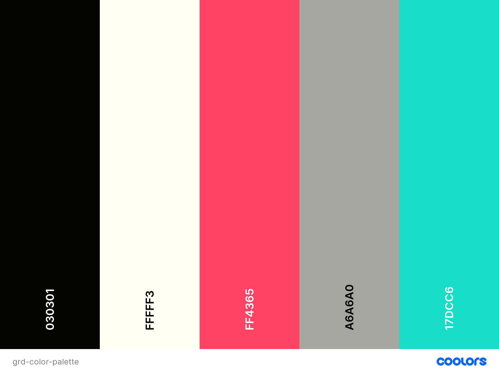

**Typography:**
The fonts chosen for the app are '[DM Serif Display](https://fonts.google.com/specimen/DM+Serif+Display?query=DM+)' and '[Raleway](https://fonts.google.com/specimen/Raleway?preview.text=Gym%20Rat%20Dictionaries&preview.text_type=custom)'. They were selected as both styles are clean and simple yet are similar to font styles seen in dictionaries worldwide, and therefore, in keeping with the overall aesthetic and purpose of the app.

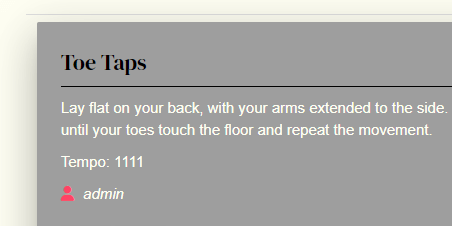

**Images:**
The images chosen are all fitness orientated and intuitively provide further context to the purpose of the site. The option for users to provide imagery along with their definition was included as it provides visual context to the definition. 

# **Features:**
## **Existing Features:**
**Navigation Bar:**
The navigation bar is available in the default position and allows users to quickly identify the different sections of the site. On mobile and tablet viewports, these sections are available in a collapsible menu to provide a cleaner layout on smaller screens. The sections presented on the nav-bar change depending on the following: 
1. Whether the user is logged in.
2. Whether the user logged in is actually a site admin.
3. Whether the user is casually browsing the app.

### **If the user is logged in, the navigation bar will display the following:**

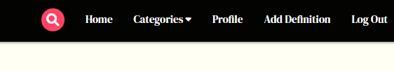

### **Mobile:**
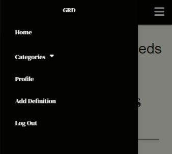


### **If the user logged in is a site admin:**

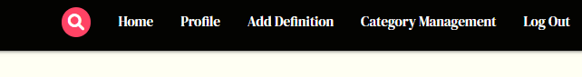

### **Mobile:**
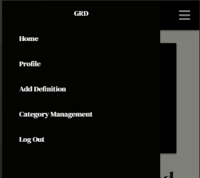


### **If the user is casually browsing the app:**


### **Mobile:**
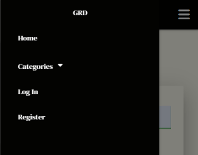


The changes in the nav-items presented in the navigation bar depend solely on the status of the user. Changes will be seen depending on whether you are casually browsing, are registered user, or a site admin. For both the registered user and site admin there is additional functionality made available. 

### **Search Functionality:**
As the app was constructed in a mobile-first approach with user interaction and experience in mind, the choice was made to build the search bar functionality directly below the navigation bar. It is hidden until toggled by the search icons as seen in the navbar, or in the floating action button available on the bottom right hand corner of the screen. This was implemented to aid users on the go, perhaps at the gym, mid-workout. It minimises the amount of limited time a user has to spend trying to find the exercise definition they are looking for. As the site's function is primarily a glossary or dictionary, its search functionality needs to be easily identified and accessed.

Initially, in the pre-development stage of the project, the plan was to add the search bar into the navbar itself, as documented in the wireframes of the project. However it was decided to alter its positioning in the development stage to just below the navigation. It is accessible on all site pages and the search results are rendered on definitions.html.s 


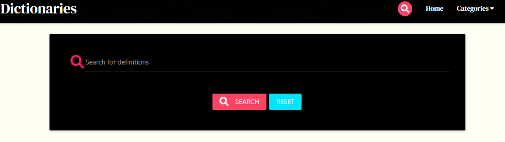  
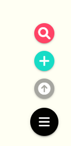


### **User Accounts:**
To register or create an account with the app, the user is required to provide a unique, validated username and password. To log in, a registered user will be prompted to provide this username and password to gain access to their account. Security measures have been put in place by the site owner to protect user log-in details. Once logged in the user will be redirected to their profile page.

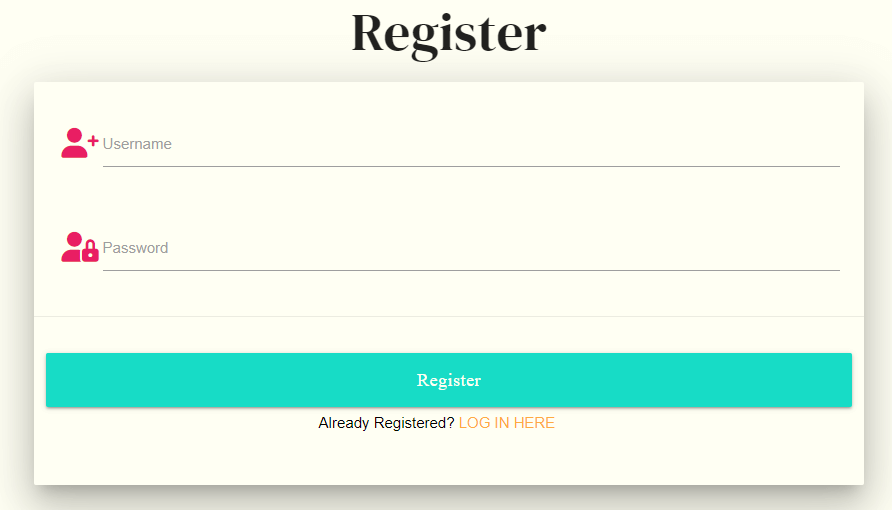
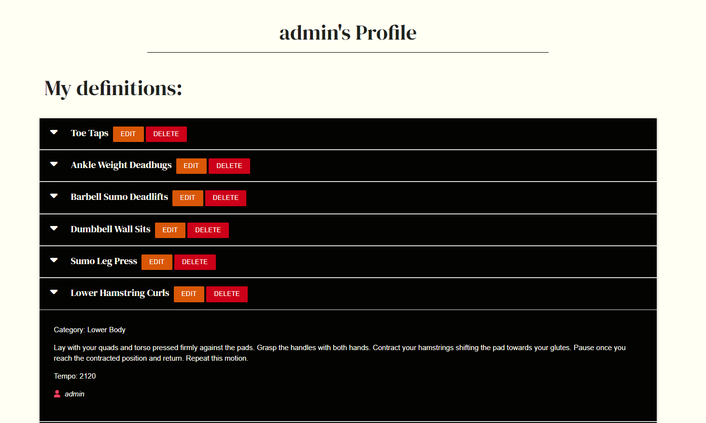

### **Categories:**
To present the data in an organised and intuitive fashion, the site owner has chosen to track and catalogue the exercise definitions by category. The following breakdown of categories have been created to help organise the definitions: 

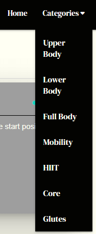

Upon creating a definition, the user must as a requirement, select which category the definition fall underneath. 

### **Creation/Management of categories:** 
The functionality surrounding the creation and management of categories is restricted to the site owner and admin. While registered and casual users can browse the categories available, only the site owner and admin will have access to category CRUD operations. Admin can access the individual category pages through clicking on its title in category management. 

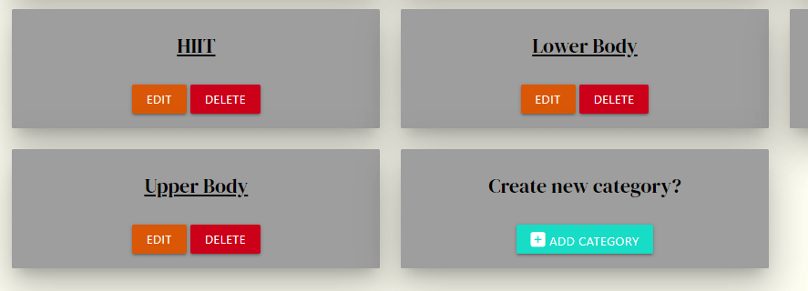

### **Admin functionality:**
Alongside category management and creation, admin's also have the ability to delete definitions created by registered users. This functionality was introduced through conditional formatting to grant permission to admins to delete malicious or unrelated content from the site on behalf of the users.

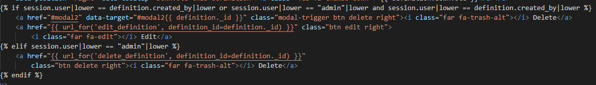  

### **CRUD Operations:**
The following CRUD operations are restricted to registered users of the app only: 
* Create
* Update/Edit
* Delete

**Note:** Registered users only have access to perform CRUD operations on their **own definitions**.  

Casual or first-time users of the app are able to browse through definitions and categories but, will not be permitted to perform the aforementioned operations. 

### **Floating Buttons:**
The addition of floating buttons (scroll to the top, add definition and search) were added to enhance both UI and UX. On any page where the navigation bar is no longer visible, users can instead use the floating buttons to either search for a definition, add a definition, or scroll to the top. This was implemented primarily for smaller viewports but was added to all viewports to increase user satisfaction towards the app. 


### **My Favourites:**
The my favourites functionality was provided to allow users to save their favourite definitions onto their profile page, alongside their own uploaded definitions. Users can add a definition to their 'My Favourites' by clicking on the HEART icon available on each definition panel, further increasing user interaction with the app.


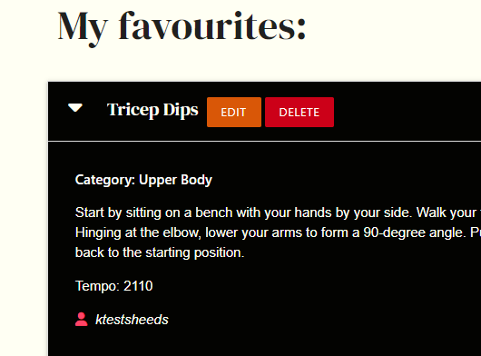

### **Upvote and downvote functionality:**
Promotes further user interaction with the app and also gives the user a sense of community, as the functionality displays the amount of 'upvotes' or 'downvotes' a definition has gotten from the Gym Rat Dictionaries community. Both icons to vote on a definition are displayed on each definition panel and a user can simply click it to vote on a definition.

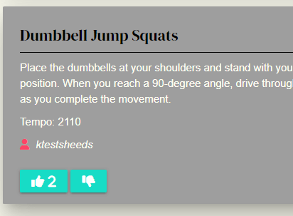

### **Share a definition:**
The decision to integrate the option to share a definition was twofold, it would help: 
* To increase traffic to the app by allowing users to share definitions across various social media platforms. 
* To encourage further user interaction and satisfaction with the app, as sharing across platforms is standard/common practice amongst all apps. 


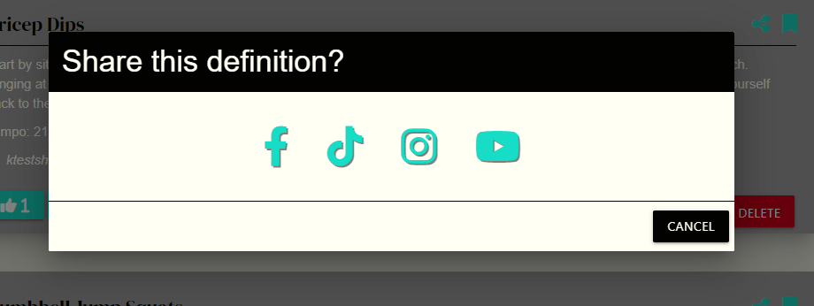

### **Adding an image or video URL:**

Users have the option to upload an image or video URL to include with their definition. This can be done when creating a new definition by pasting the URL into the appropriate input field, or can be added at a later stage by adding the URL to the appropriate field in the edit definition form. Only URL's will be accepted into this input field to be uploaded to the database. The images or videos will not be displayed on the definition panel or the site but will be accessed in a new, external tab. This functionality was implemented solely to supplement the definitions and provide further visual context to the user. 

INSERT IMG HERE OF LINK

### **Pagination:**
Was implemented in the following areas to increase UX and to break up content-heavy pages:
* Home
* Search results (if necessary)
* Individual category pages 

This will be extremely helpful as the database expands and will help users navigate the site more easily. Each of the following areas will only display 8 definitions per page so as not to overwhelm the user and allow them to process the information at a reasonable pace. 

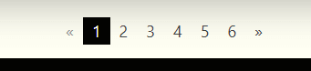

## **Features left to implement:**
* Introduce a 'definition of the day' functionality - where registered users receive a daily definition through email.
* Random definition generator - would generate a random definition from the site.
* Create a workout from the app definitions - to allow the user to compile definitions to create their own customised workout, which they could then share either on Gym Rat Dictionaries or on another social media platform. 
* Create new categories for user-created workouts - Once users had compiled and created their own workouts from the app definitions, they could then upload it to the workout category. 

# **Technologies Used:**
## **Languages:**
* [HTML5](https://en.wikipedia.org/wiki/HTML5) provided the structure and content for this project.
* [CSS3](https://en.wikipedia.org/wiki/CSS) provided the style of the HTML5 elements.
* [jQuery](https://jquery.com/) was used to implement JavaScript functionality across the site.
* [Python](https://www.python.org/) the backend of the project was written using Python.

## **Frameworks, packages, libraries & toolkits:**
* [Pip3](https://pip.pypa.io/) was used to install packages for python.
* [Dnspython](https://pypi.org/project/dnspython/) was used as a DNS toolkit for python.
* [Font Awesome](https://fontawesome.com/) supplied the icons used across the site.
* [Google Fonts](https://fonts.google.com/) supplied the two fonts used across the site.
* [Materialize](https://materializecss.com/) was used for the design framework.
* [Flask](https://flask.palletsprojects.com/) framework provided the tools, libraries and technologies needed to build this web application. 
* [Flask-PyMongo](https://flask-pymongo.readthedocs.io/en/latest/) is the Mongodb driver for python. This flask application leveraged PyMongo to access the MongoDB Atlas database. 
* [Jinja](https://jinja.palletsprojects.com/) template engine and language that renders the pages of this site. Jinja is a Flask dependency.
* [Werkzeug](https://werkzeug.palletsprojects.com/) was used for password hashing and to provide authentication. 


## **Other technologies:** 
* [GitHub](https://github.com/) used to host the GRD repository.
* [Git](https://git-scm.com/) used for version control of GRD  project.
* [GitPod](https://www.gitpod.io/) used to develop the project. 
* [MongoDB](https://www.mongodb.com/) used to structure and host user data. 
* [Heroku](https://www.heroku.com/) used to deploy the live site.
* [Balsamiq](https://balsamiq.com/) used to create the wireframes for the GRD project.
* [PowerMapper](https://www.powermapper.com/) used to verify cross-browser compatibility. 
* [Favicon.io](https://favicon.io/) used to create GRD favicon.
* [RandomKeygen](https://randomkeygen.com/) used to generate a secure password for environment variable `SECRET_KEY`.
* [Upsplash](https://unsplash.com/) free images site that provided the images used throughout the site. (Acknowledgments in the credits section)
* [Autoprefixer CSS](https://autoprefixer.github.io/) used to parse CSS and add vendor prefixes to custom CSS file. 
* [Am I Responsive](http://ami.responsivedesign.is/) used to create the demo image seen in the README.
* [Lighthouse](https://developers.google.com/web/tools/lighthouse) used to audit the app for improved performance and UI.


## **Testing:**
* [Chrome Dev Tooks](https://developer.chrome.com/docs/devtools/) was used to detect issues and test the responsiveness of the site. 
* [W3C Markup Validation Service](https://validator.w3.org/) is a validator used to test for errors in the HTML5 code.
* [W3C CSS Validation Service](https://jigsaw.w3.org/css-validator/) is a validator and was used to test for errors in the CSS3 code. 
* [JShint](https://jshint.com/) is a validator and was used to test for error in the Javascript code.
* [PEP8 Online Check](http://pep8online.com/) is a python style guide checker used to test the python code against the style conventions set out in PEP8. 


# **Database - MongoDB:**
## **Schema:**
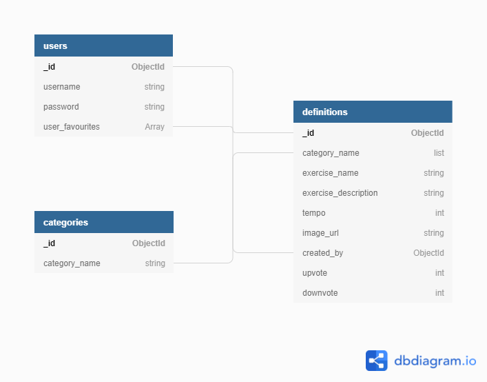


## **Breakdown of Collections:**
### **Categories:**
| Key           | Value Type |
|---------------|------------|
| _id           | ObjectId   |
| category_name | String     |


### **Users:**
| Key             | Value    | Description                                  |
|-----------------|----------|----------------------------------------------|
| _id             | ObjectId |                                              |
| username        | String   |                                              |
| password        | String   | Hashed/Salted for security                   |
| user_favourites | Array    | Definition_id of users favourite definitions |


### **Definitions:**
| Key                  | Value    | Description                                   |
|----------------------|----------|-----------------------------------------------|
| _id                  | ObjectId |                                               |
| category_name        | String   | Category chosen by user from Categories       |
| exercise_name        | String   |                                               |
| exercise_description | String   | Breakdown of how to perform the exercise      |
| tempo                | Int      | Pace the exercise should be performed at      |
| image_url            | String   | URL of image users can upload with definition |
| created_by           | ObjectId | ObjectId taken from users                     |
| Upvote               | Int      | Increment the amount of upvotes a specific definition has   |
| Downvote             | Int      | Increment the amount of downvotes a specific definition has |


# **Testing:**
Due to the size of the testing section, you can find all documentation related to the testing of Gym Rat Dictionaries [here](/TESTING.md)

# **Deployment:**
## **Git:**
**Using Git to add, commit and push code into a repository:**
Storing files in Git is a two-stage process:
​1. Files must be **added to the staging area** using the "**git add**" command followed by the specified file name.

​2. Files must be **committed** to the repository using the "**git commit -m**" command followed by a specified message within double quotation marks.  

**Note:**  that it is common practice when making your first commit to a repository to provide the message "**Initial commit.**".

**Pushing code to GitHub:**

This is achieved by connecting your local repository with your remote repository and pushing the code from local to remote. Storing your code in a remote repository on a remote server allows it to be backed up and also be accessed by others. Once you have added the files to the storing area, committed the files to the repository, you then push your files to GitHub. Using the "**git push**" command to push the code from your local repository to the remote repository. 

**To commit changes to your local repository and push to your remote repository:**
* Start from the terminal by pressing  **CTRL+C**  to stop the server.
* Run "**ls**" to list the files.
* Begin adding and committing the code as outlined in step 1 & 2 of storing files in Git.
* Run "**git status**" to view all files added to the staging area.
* Run "**git commit -m**" followed by your message contained in double quotation marks, adding the files to your local repository.
*  Once the files have been committed, push them to the remote repository using "**git push**".
 
For more information on commonly used Git CLI instructions, check out this [cheatsheet](https://training.github.com/downloads/github-git-cheat-sheet.pdf)

## **GitHub:**
This repository is hosted by GitHub, but deployed by Heroku.
    
**Clone this repository:**
To run  **locally**, you can clone this repository, or pull the code from this GitHub repository:

Method 1:
* Navigate to the main page of the repository.  
* Above the list of files, click the '**Code**' button.
* To clone the repository using  **HTTPS**, under  '**Clone with HTTPS**', click the  **clipboard**  symbol.
* Open Git Bash.
* Change the current working directory to the location where you want the cloned directory.
* Type  `git clone`  and paste in the copied URL
`$ git clone https://https://github.com/KSheeds1/Gym-Rat-Dictionaries`
* Press  **Enter**  to create your local clone.

Method 2:
* Click **Open with GitHub Desktop**.
* Follow the prompts in the GitHub Desktop application or follow the steps outlined in the [GitHub Docs](https://docs.github.com/en/free-pro-team@latest/github/creating-cloning-and-archiving-repositories/cloning-a-repository#cloning-a-repository-to-github-desktop) for cloning a repository.


### **Note:** In order to clone this repository, you will need to create the following:
#### 1. Install necessary packages listed in the requirements.txt file:
This can be achieved by running the following command in the terminal of your IDE: 
`pip3 install -r requirements.txt`


#### 2. MongoDB database:
(Or a database similar to the database documented in the Database section of this README.)
* Login or register with MongoDB.
* Create a cluster and a database.
* Create three collections in the database: **Categories**, **Users**, and **definitions**.
* Add the neccessary key-value pairs for each of the collections. The schema breakdown for this project can be found [here](#schema-/-data-model) and can be used to set up your collections. 

#### 3. Create the necessary environment variables:
* Create a .gitignore file in the root directory of the project. 
(A gitignore file specifies intentionally untracked files that Git should ignore. For more information on gitignore files, check out the [Git documentation for gitignore](https://git-scm.com/docs/gitignore).)
* Add the env.py file to the gitignore file: `env.py`
* Create the env.py file (this can be done from the terminal: `touch env.py`)
* This file will contain the environment variables: 

       Import os
        
        os.environ.setdefault("IP", "INSERT IP")
        
        os.environ.setdefault("PORT", "INSERT PORT")
        
        os.environ.setdefault("SECRET_KEY", "INSERT SECRET_KEY")
        
        os.environ.setdefault("MONGO_URI", "INSERT MONGO_URI")
        
        os.environ.setdefault("MONGO_DBNAME", "INSERT MONGO_DBNAME")
  
#### 4. Run the app:
* In the terminal of your IDE, type the following command to run the app:
`python3 app.py`
* Click on option to view the site in the **browser**.


**Fork this repository:**
A fork is a copy of a repository that you manage. Forking a repository allows you to freely experiment with changes without affecting the original project.

To fork this repository:
* Log into GitHub and navigate to this repository [here](https://github.com/KSheeds1/Gym-Rat-Dictionaries)
* In the top-right corner of the page, click '**Fork**'.
* From there, you will have a copy of the repository.


  

## **Heroku Deployment:**
This project was deployed using Heroku. Heroku is a platform as a service that enables developer to build, run and operate applications entirely in the cloud. Heroku integrates with GitHub to make it easy to deploy code living on GitHub to apps running on Heroku. 

### Prior to creating the Heroku application:
Before creating the Heroku application, you must first set up two files which Heroku needs to run the app

**Requirements.txt & Procfile:** 
* Requirements.txt is used to specify what packages are required to run the project.
* The Procfile specifies the commands that are executed by the app on start-up. 

To **create these files**, use the following code in the **GitHub Terminal**:

```
pip3 freeze --local>requirements.txt
echo web: python app.py > Procfile
```

**Note:**  The Procfile may have a blank line at the end of the file which can cause problems when running the app on Heroku, make sure to delete it and save the file. 

### **On Heroku:** 
Sign in or create an account on heroku.com:
* Click '**New**' on the dashboard and select '**Create new app**'. 
* Provide a unique app name including dashes, select your region, and click '**Create App**'.

**Connecting to GitHub:**

From the dashboard, click on the **Deploy** tab:
* From the '**Deployment Method**' section, click on '**GitHub**'.
* Provide your repository name and click '**Search**', once it finds your repository, click '**Connect**'. 

**Note:** 
**BEFORE** you enable automatic deployment, click on '**Settings**' tab and click '**Reveal Conflict Vars**' to provide your **environment variables** from your **env.py** file to Heroku:

  ```IP: 0.0.0.0

  PORT: 5000

  SECRET_KEY: YOUR_SECRET_KEY

  MONGO_URI: YOUR_UNIQUE_MONGO_URI

  MONGO_DBNAME: DATBASE_NAME
  ```

**Note:** It doesn't matter if you don't have your MONGO_URI at this time, just add it as blank.  

* Click **Hide your config vars** and go back to the Deploy tab.

**Note:** 
**Before you deploy**, you need to **push** the Procfile and requirements from the GitHub terminal.
* Navigate back to your code and in the **GitHub terminal** use the following commands:
  
      $ git add requirements.txt
      $ git commit -m "Add requirements.txt file."
      $ git add Procfile 
      $ git commit -m "Add procfile."
      $ git push


* Back on Heroku, you can then '**Enable Automatic Deployment**' from the deploy tab by clicking on **Enable Automatic Deploys** followed by '**Deploy Branch (main)**'.
* You will be able to confirm a successful deployment from the Heroku. 

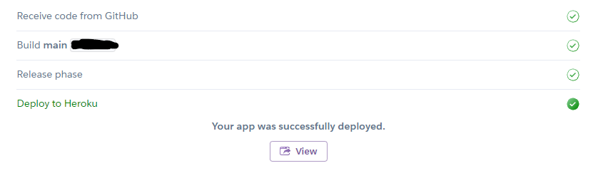

Click on **Open App** in the right hand corner of your Heroku account, this will open your live site in another tab. 

# Credits:
##  **Code:**
* The Materialize select box validation solution was the solution provided during the CI ['Task Manager'](https://github.com/Code-Institute-Solutions/TaskManagerAuth/blob/main/04-AddingATask-WritingToTheDatabase/02-materialize-select-validation/static/js/script.js) mini-project. 
* This [demo](https://gist.github.com/mozillazg/69fb40067ae6d80386e10e105e6803c9) on GitHub helped me to refactor three of my functions to implement Flask-Paginate. 
* This [Stack Overflow question](https://stackoverflow.com/questions/65477524/flask-and-jinja-template-throwing-error-object-of-type-cursor-has-no-len) helped me resolve the TypeError: object of type 'Cursor' has no len(). (See TESTING.md)
* This [Stack Overflow question](https://stackoverflow.com/questions/27980121/pylint-warning-possible-unbalanced-tuple-unpacking-with-sequence) helped me to remove the Pylint warning for 'possible unbalanced tuple unpacking'.
* This [GitHub Gist](https://gist.github.com/toshimaru/6102647) helped me to detect scrolling to the bottom of the page using jQuery. It was modified slightly to get the innerHeight of the window so it would function on all viewports. 
* This [GeeksforGeeks article](https://www.geeksforgeeks.org/how-to-detect-a-mobile-device-in-jquery/) showed me how to detect smaller viewports using JavaScript's `window.matchMedia();`
* This [Stack Overflow question](https://stackoverflow.com/questions/5599934/regular-expression-that-allows-spaces-in-a-string-but-not-only-blank-spaces/5599987) provided me with the regex pattern used to validate the form and search inputs across the site. 

##  **Content:**
* Exercise descriptions for the defintions was supplied by *Move With Us*.
* The hero image used on the home page was found on [Upsplash](https://unsplash.com/photos/oYSUTt7Cj60). This image was uploaded to Upsplash by Lorenzo Fattò Offidani.


##  **Acknowledgements:**
A big thank you to my mentor Precious for guiding me through this milestone project and my family and friends for all their support!