 # Testing documentation for Gym Rat Dictionaries
 ## Contents: 
* [Testing User Stories](#testing-user-stories)
* [Bugs: discovered and resolved during development:](#bugs-discovered-and-resolved-during-development)
* [Manual functionality testing](#manual-functionality-testing)
	* [User Authentication](#user-authentication)
	* [CRUD Operations](#crud-operations)
	* [Cancel functionality](#cancel-functionality)
	* [Features](#features) 
* [Validation Testing](#validation-testing)
* [Lighthouse performance](#lighthouse-performance)
* [Cross-browser Compatibility](#cross-browser-compatibility)
* [Responsive Testing](#repsonsive-testing) 

# Testing User Stories:
## ***As a regular user, I want to be able to:***
> ### **UST1: *Login and out of my account:***

A registered user can login to their account by clicking on 'Log In' in the Navigation Bar on the right hand side. To log out of their account, they must be logged into their account, navigate to the navigation bar and click on 'Log Out'.

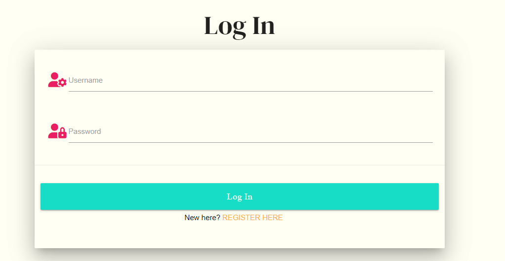

> ### **UST2: *Upload an exercise definition:*** 

Once logged in, registered users can add a definition from three places:
* 'Add Definition' nav-link
* The '+' icon in the floating action button
* 'Add Definition' button on their profile page

> ### **UST3: *View all my uploaded exercises in one place:***

Once logged in, users can navigate to their 'Profile' page from the Navigation bar and view their uploaded definitions from there.

 
> ### **UST4: *Add all my favourite definitions to 'My Favourites':***

Once logged in, users can simply click on the 'Add to Favourites' icon featured on each individual definition card panel to add a definition to their favourites. They can then view their favourites on their profile page. 

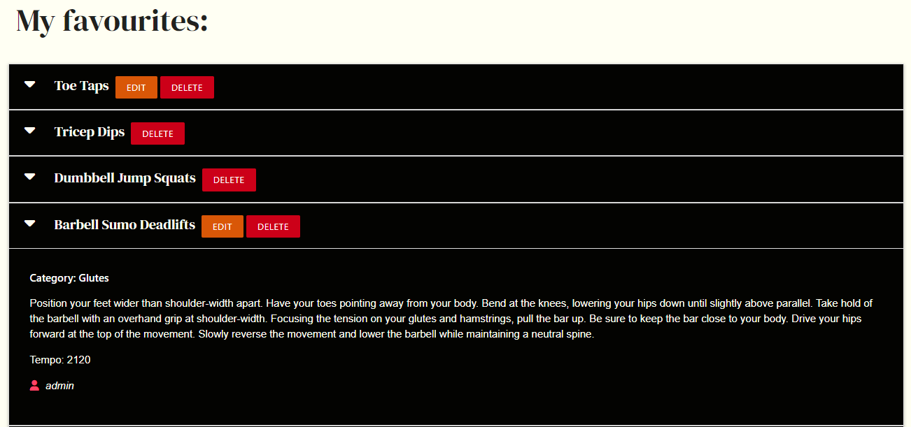

> ### **UST5: *'Upvote' or 'Downvote' a definition:***

Logged in users can 'upvote' or 'Downvote' a definition by simply clicking on the thumbs up or down icon featured on each individual definition card panel, the amount of votes for both are displayed on the icon and incremented by one when clicked.

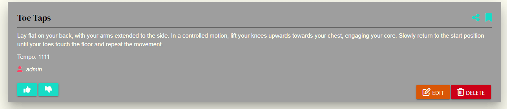
 
> ### **UST6: *Edit any definition I have added:***

A logged in user can choose to edit any of their own added definitions. This can be achieved across the site:
* On the users profile page
* On the home page
* On any of the category pages
* By searching for a specific definition in the search bar and accessing the definition in the search results. Click on the edit button to redirect to the edit definition form. 

 Each card panel has an 'Edit' button. 
	* To edit a definition, a user can click the 'Edit' button, which will redirect them to the 'Edit Definition' form. From there, they will be able to edit the pre-existing data, and choose to save the changes or cancel. 

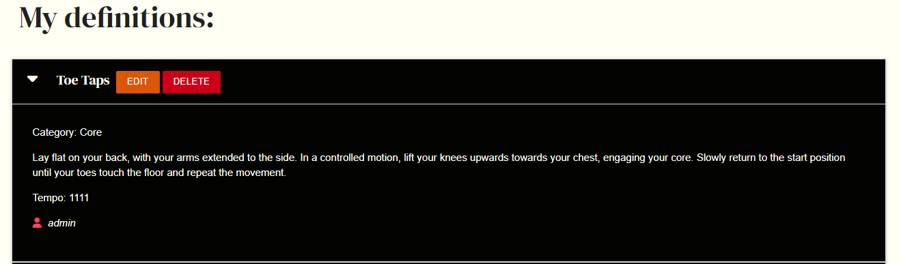
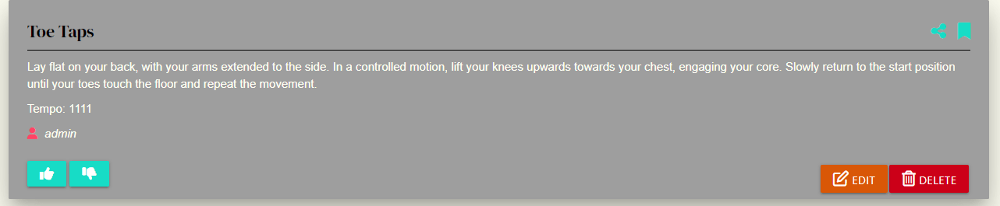
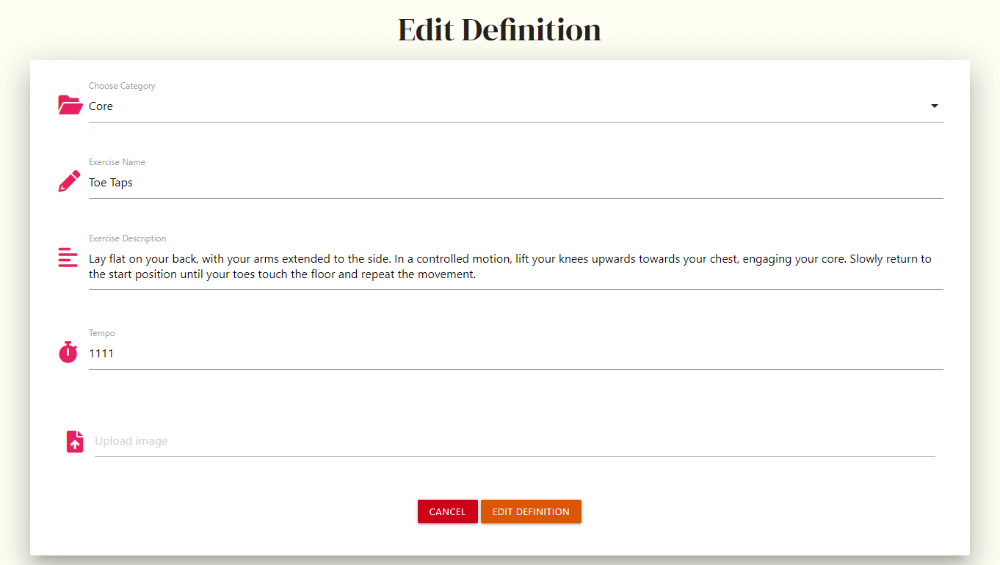

### **UST7: *Delete any definition I have added:***
A logged in user can choose to delete any of their own added definitions. This can be achieved across the site:
* On the users profile page
* On the home page
* On any of the category pages
* By searching for a specific definition in the search bar and accessing the definition in the search results. Click on the delete button. 

**Note:** Clicking on the delete button triggers a user confirmation modal, the user must confirm their choice by clicking on the delete button in the modal to delete the definition. 

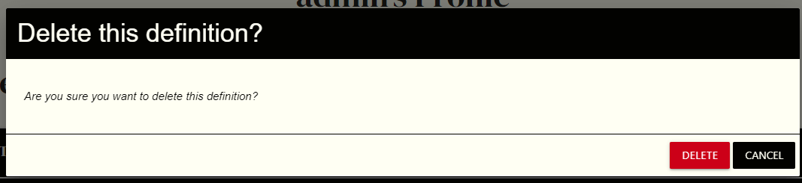

## ***As a first-time user, I want to be able to:***
> ### **UST8: *Identify the different categories of definitions available on the app:***

First-time users can browse the different categories of exercise definitions by clicking on the 'Categories' nav-item and selecting a category they wish to browse from the dropdown. This will direct them to the specific category collection.

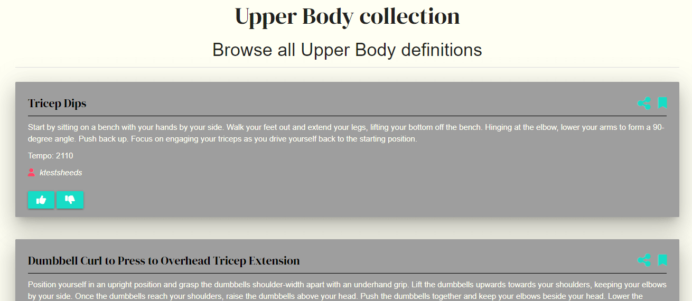

> ### **UST9: *Search for a particular definition quickly:***

Casual users of the site can search for a particular definition quickly by using the search bar, which can be accessed in two places: 
* From the magnify glass icon in the Navigation bar, which triggers the search bar 
* The magnify glass icon FAB located on the bottom right hand side of the app, which scrolls the user to the top and triggers the search bar. 

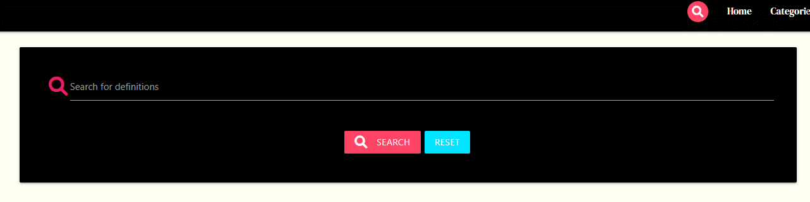

> ### **UST10: *Create an account if I like the content of the site:***

First-time users can create an account or register with the app by navigating to the nav-bar and clicking on the nav-item for 'Register'. From there they will be prompted to create a unique username and to provide a validated password. The user will know that they have succeeded in creating an account as they will be redirected to their new profile page and will see a successful registration flash message. 

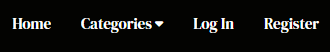

> ### **UST11: *To share a definition on my Facebook or Instagram account:***

Even casual, first-time users can choose to share a definition from GRD to their social media account, this can be achieved by clicking on the share icon featured on each individual definition card panel and choosing from the options made available in the share modal. 

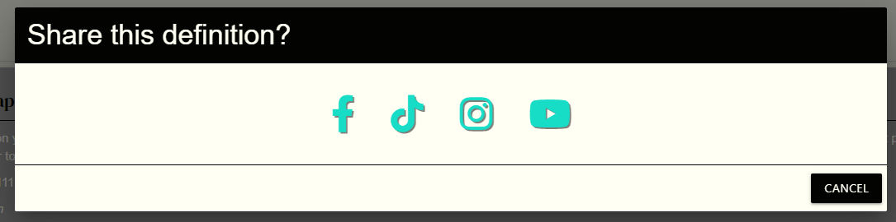

> ### **UST12: *To quickly find a definition while I'm at the gym:***

Anyone can quickly find a definition on the go by accessing the site and searching for the definition using the search bar. This can be accessed from the magnify icon in the nav-bar or in the floating action buttons. If the definition has been added, it will be returned in the search request, if it has not been added, the app will inform the user thusly. 

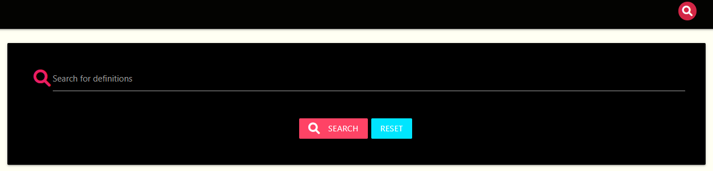
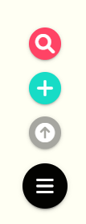

## ***As the site owner/Admin, I want to be able to:***
> ### **UST13: *Add a new category to the site:***

Adding a new category to the app is restricted to both the site owner and admin. Once logged in as either, they can navigate to the 'Category Management' page from the navigation bar and click on the card panel that reads 'Add New Category'. From there they can fill out the form to create a new category and select to 'Create' or 'Cancel' if they decide not to add a new category.

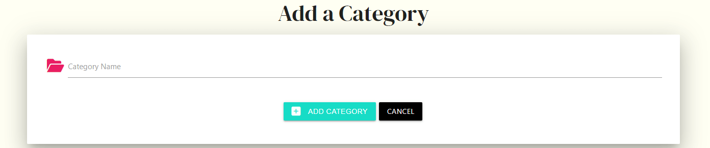

> ### **UST14: *Edit an existing workout type category:***

This functionality is restricted to both the site owner and admin. To edit a category, navigate to Category Management, by clicking on the nav-item 'Category Management'. Once redirected to the page, the admin or site owner will have the option to click on the 'Edit' button offered on each category panel. Once selected, an admin can edit the pre-existing data in the 'Edit Category form'. If they wish to save the changes select the 'Edit Category' button or to cancel the changes, select 'Cancel'. 

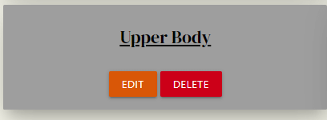

> ### **UST15: *Delete an existing workout type category:*** 

This functionality is restricted to both the site owner and admin. To delete an existing category, navigate to the Category Management page from the nav-bar. Once redirected to the page, the admin or site owner will have the option to click the 'Delete' button attached to each category. Once clicked, the user will be prompted to confirm the action prior to deletion, they can choose to either delete or cancel to be redirected to the category management page. 

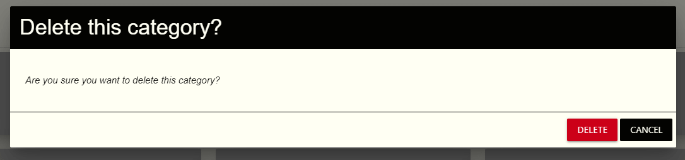

# **Bugs: discovered and resolved during development:**

# **Loss of functionality to 'add' and 'edit' buttons:**
A loss of functionality for the 'add' and 'edit' buttons featured on the add_definition and edit_definition forms was discovered following the completion of the POST method for the edit_definition form. When manually testing the edit_definition function, by updating a definition, the 'edit' button would not send the updated definition to the database. Nor would the 'add' button on the add_definition form add a definition to the database. A change in color of the buttons when clicked was also noted. 

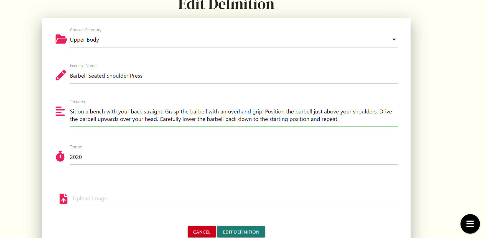

With no errors being thrown, I check over both the add_definition and edit_definition functions in app.py but everything seemed in order. Both form templates were rendering so I turned to the HTML for both templates. After running both forms through the [W3C Markup Validation Service](https://validator.w3.org/#validate_by_input) an error was thrown for the form tags surrounding the image_url input field on both forms that 'nested forms are not allowed'. The addition of this nested form was the root of the issue. 

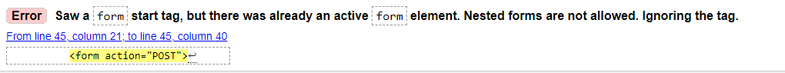
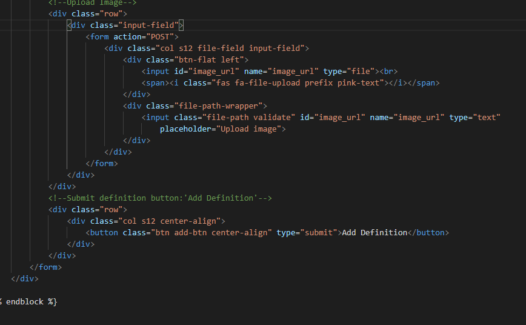

Upon removal of the nested form, the functionality of both the 'add' and 'edit' buttons on their respective forms was restored. 

# **Multiple 'delete' buttons added to definitions created by admin:**
A bug was discovered when an admin user added a definition to the site. Once redirected back to the home page, the new definition card had two delete buttons. The conditional rendering put in place at the time to restrict access to the 'edit' and 'delete' buttons was as follows:

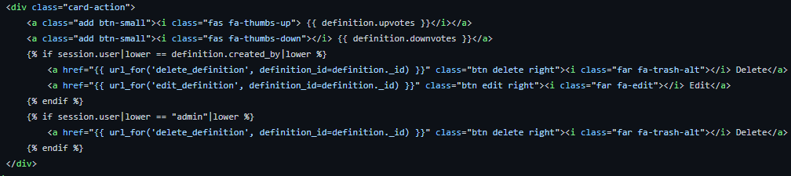

* If the session user created the definition, they had access to edit or delete the definition. 
* Admins were also granted permission to delete user added definitions as a means of removing malicious or unrelated content from the site. 

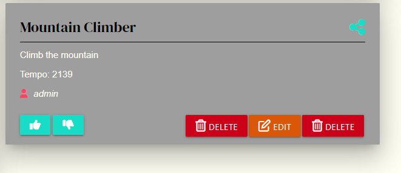

However, the template logic put in place was flawed, as the likely occurrence of an admin adding a definition to the site was overlooked. The conditional rendering that had been implemented was ill-defined, and so, was refactored.

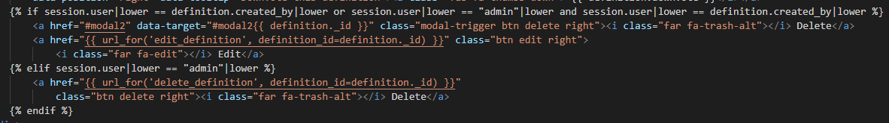

Access to both the edit and delete functionality was granted under the following specifications: 
* If the session user created the definition.

OR

* If the session user is an admin AND created the definition.

ELSE 

* If the session user is an admin (they will have access to the delete function on all user added definitions.)

The refactoring of the conditional formatting resolved the bug. 

# **Loss of functionality to add and edit form's category select input:**

Following the implementation of the @app.context_processor and the category_pg function, there was a loss of functionality for both category select inputs on the add and edit definition forms. The categories to choose from in the add definition form were no longer available and the pre-existing category in the edit from was also gone. 

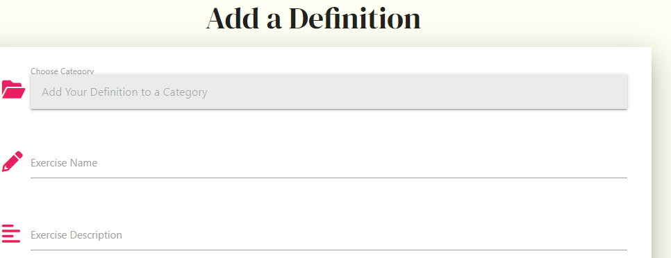
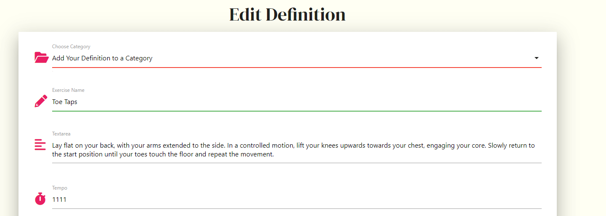

Initially it was believed that the issue was due to the fact that the select inputs were actually `<ul><li>` structures and shared the same 'dropdown-content' class as the navbar and sidenav dropdown menus.

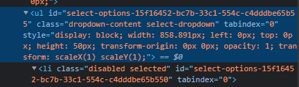

 However, after reviewing both functions in app.py, it became clear that the bug arose from attempting to reuse lists in Jinja, the for-loop of 'categories' was now listed three times. To rectify the bug, the find() methods in both add_definition and edit_definition were wrapped inside a python list to convert the Mongo cursor objects 'categories' into proper lists. Following this, functionality returned to both forms. The pre-existing category selection for edit was readily available, as were the category selection options in the add definition form. 
 
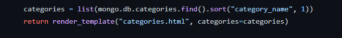
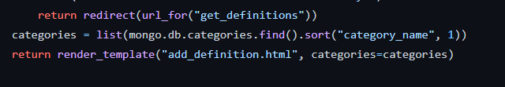

# **Displaying user favourites on profile page:**
An issue arose when attempting to display user favourites on the profile page. A user's favourites are saved to an array 'user_favourites' in the users collection. While the definitions were being updated into the array, and for-loops and Jinja conditional 'if' statements were employed in profile.html to display only session user created definitions and user favourite definitions, all attempts to display the user favourite definitions were unsuccessful.

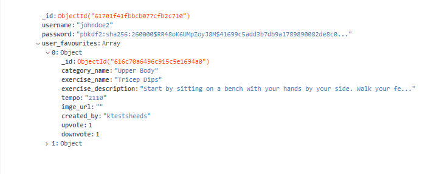
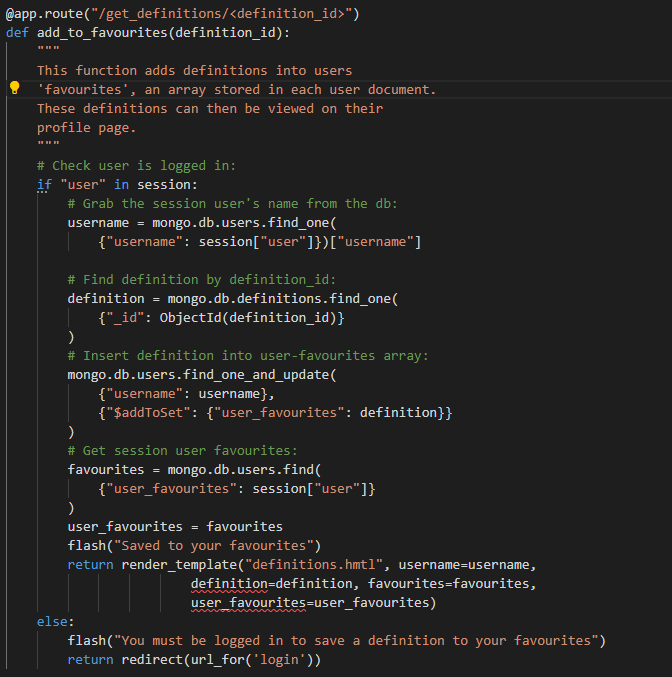
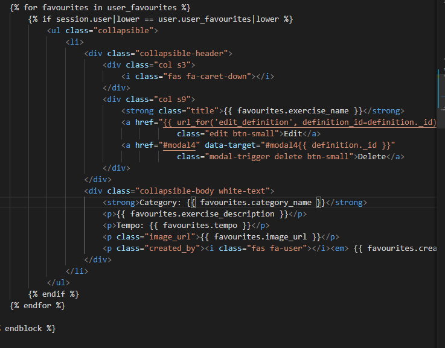

To resolve this issue, both the profile and add_to_user_favourites views were reviewed. When reviewing the profile view, initially "username" was being passed through, which only pointed to a string and the definitions variable was only returning definitions specific to those created by the session user. The original filter was too specific.

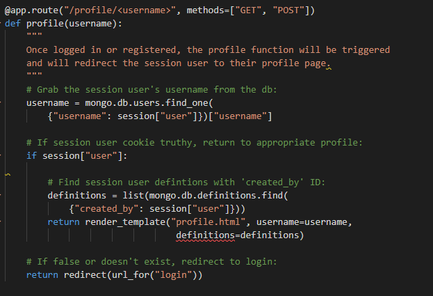

In order to resolve the bug the profile view was altered to gain access to all user document fields by passing through the Mongo Object "user" and the projection parameter was removed from the find method. This allowed for all definitions to be accessible from the profile page. A slight refactoring of the add_to_favourites view was also implemented, it was decided to only store the ObjectId for each definition in the user_favourites array rather than the whole definition and to get.

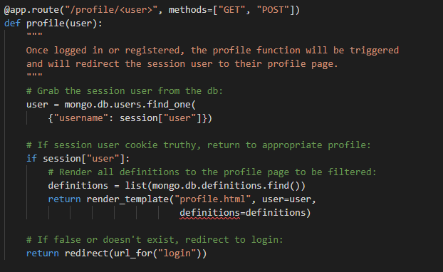
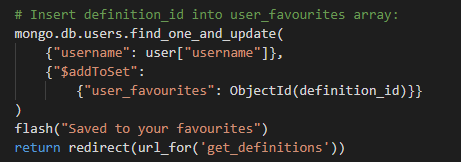
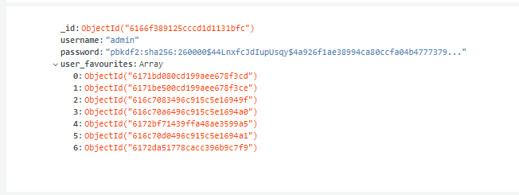

The next step in resolving the bug was to figure out how to phrase the Jinja for loops to filter the definitions on the profile. Firstly it was confirmed that the array of ObjectId's were being rendered to the profile template using `{{ user.user_favourites }}`

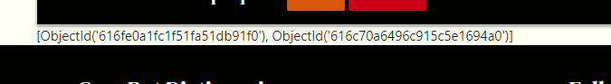

A filtered for-loop was then employed to check all definitions against the conditional if statement using the IDs as the check, and displaying those that match the filter. The changes made to the profile and add_to favourites views, and the filtered for-loop on profile.html resolved the bug and both session user created definitions and their favourite definitions were now displaying on the profile page.

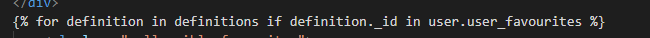

# **Pagination bugs:**
Three routes for the project were refactored to include pagination: 
* get_definitions
* categories_pg
* search

When first implemented, the pagination seemed functional, definition panels per page were limited and the pagination links were in working order on definitions.html and category_pg.html. However when attempting to search an error was thrown pointing at the if statement in definitions.html

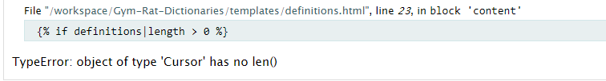

Following some research of this issue, a suitable fix was found in this [Stack Overflow question.](https://stackoverflow.com/questions/65477524/flask-and-jinja-template-throwing-error-object-of-type-cursor-has-no-len)
To resolve the TypeError  the 'definitions' lists were changed to return a cursor object instead and the if statements were updated also. 

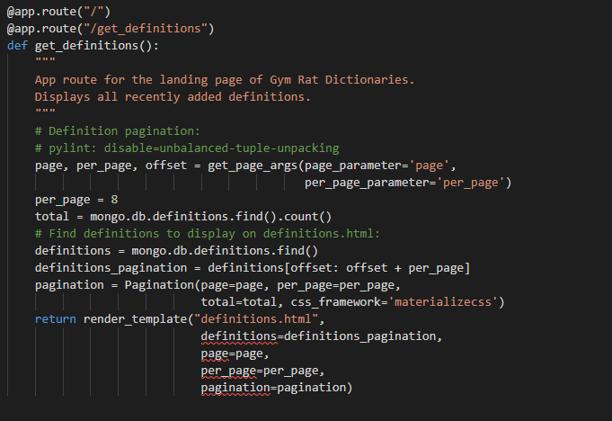
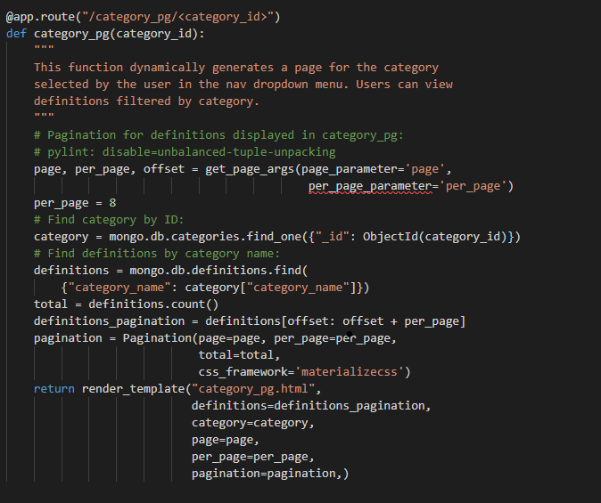
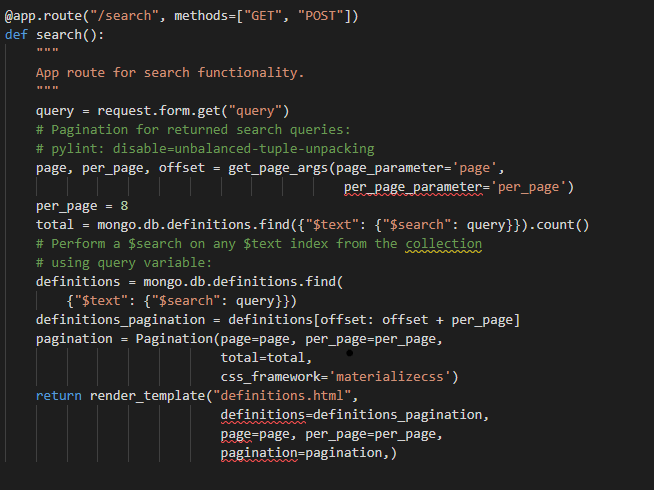
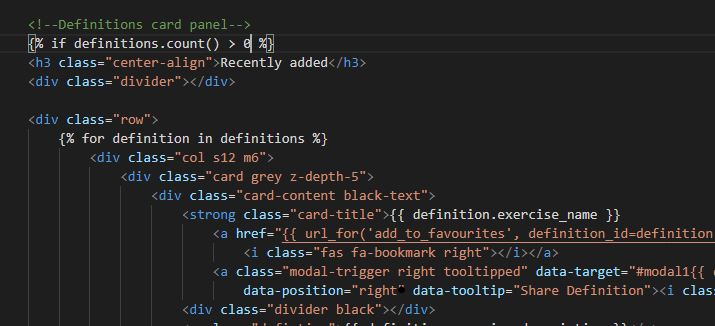

These changes to the code seemed to rectify the issue and all aspects of the Flask pagination seemed to be functional. These changes were then pushed to Git. 

However, when later returning to development again, and attempting to save a definition to 'favourites', an error was thrown and new bug had appeared. While the definition was being added to the user_favourites array in the User collection, the profile page was no longer accessible.

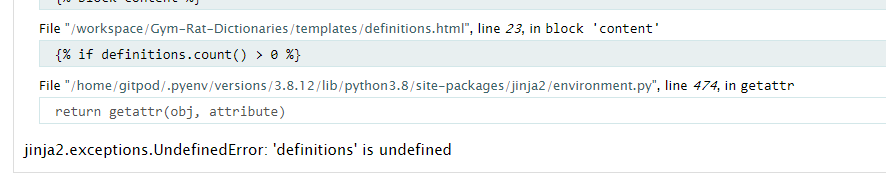 

Upon reviewing the app.py file and definitions.html it was decided that this bug was due to the change from lists to cursor objects, 'definitions' was no longer iterable more than once. The decision was made to return the cursor objects to lists and attempt to deal with the search functionality differently. Once this change had been made, functionality was returned. Even access to the search functionality also seemed possible, however when attempting to view the second page of search results an error was thrown:

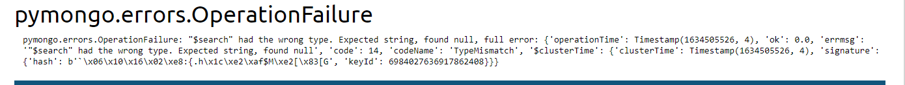

Some research and guidance was necessary to resolve this bug. Initially, the plan to resolve this issue was to build a second route to split the search functionality. Maintain the original route as a post request, the initial search query and build a second route to deal with the pagination and subsequent requests. However this was abandoned for a much more straightforward approach. 

It was decided to keep the current pagination and just change the form from `POST` to `GET`. Following this approach, the `GET` method passes the query term into the URL args, using `request.args.get()` to get it from the args, to search the database and paginate. So the query cannot be lost from the args upon pagination. The following alterations were made to the code to implement this: 

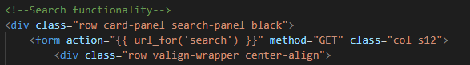

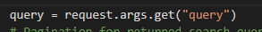

Following this all aspects of pagination were manually tested and all bugs and issues surrounding pagination had been resolved. 

# **Registration bug:**
A bug was discovered when registering a new user to the site, relating to both the register view function and the user_favourites array. 

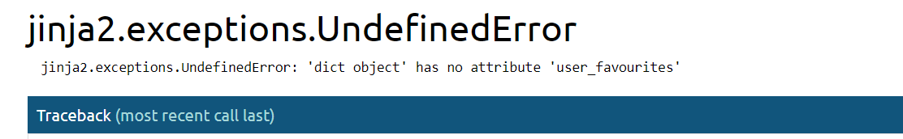

After reviewing the 'User' collection on MongoDB, it was noted that newly created users being inserted into the collection did not have a 'user_favourites' array. To rectify this issue, the register view needed to be refactored. Prior to this, the register function inserted a dictionary object 'register' into the database, inserting the username and password. 

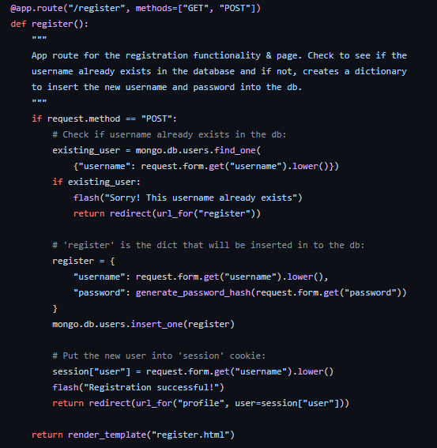

This was the root of the bug, an empty 'user_favourites' array needed to be inserted along with the username and password for new users to add definitions into. This issue had been overlooked by the developer as when building the add_to_favourites function, she manually inserted the empty array into users accounts to test the functionality. The bug was resolved easily by adding an empty array into the register dictionary to be inserted into the User collection.

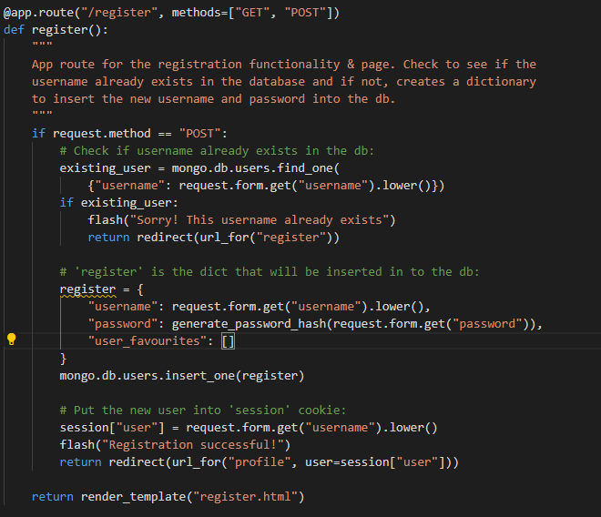

The refactored function was then tested manually by registering a new user. The register dict no longer threw a TypeError and was redirected to their profile page. The user was then able to select definitions to add to their favourites, the add_to_favourites function inserts the definition_id into the array and the definition is then displayed on their profile page.

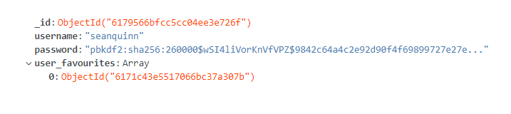
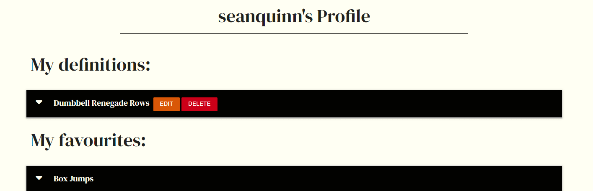

# Displaying the profile page rendered for newly registered users:
It was noticed when a new user registered with the site that the 'else' block of the profile page was not rendering to the site. When overviewing the profile function in app.py, it was noted that the jinja if statement,  would always be considered as true as the developer was sending the definitions collection to the profile so that they could be filtered to display my definitions and my favourites.

 

This was the root of the bug, the else block of the code was never going to be rendered as definitions were always going to be greater than zero on profile.html. In order to resolve this issue, it was decided to only send definitions created by the session user and to create a new array of the user_favourites array (a field in each definition in the definitions collection) to match the definitions by ID to those saved in the session users 'user_favourites' array and send that to the profile.

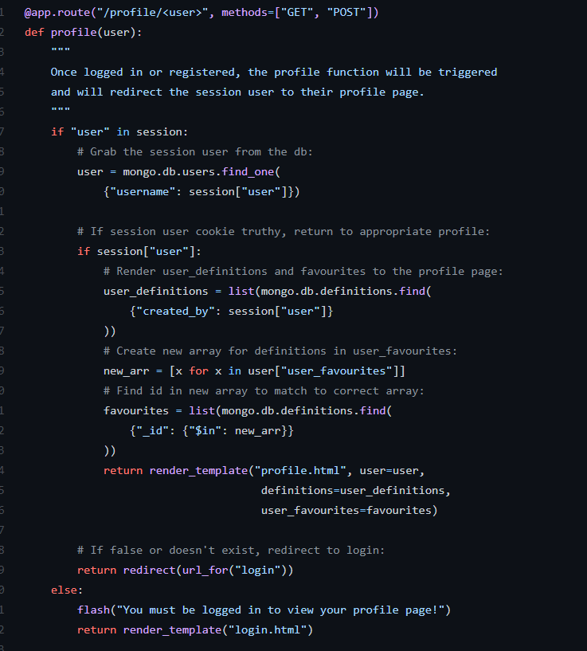

On profile.html some refactoring was necessary to help render the profile depending on the users status. The jinja conditional rendering for my definitions and my favourites was paired backed, and additional conditional formatting statements were added to render elements depending on the users status. These changes resolved the issue at hand, when registering as a new user the else block of the code now displayed to the profile.

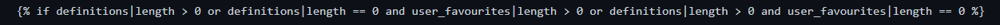
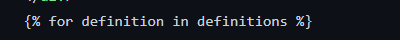
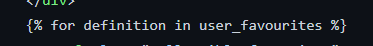
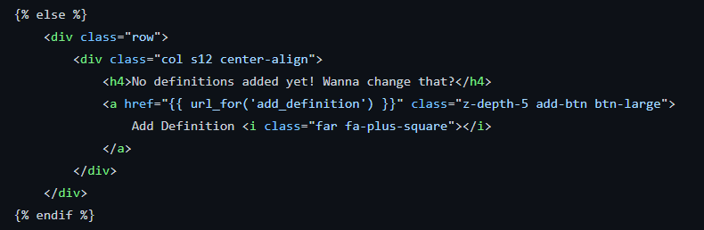
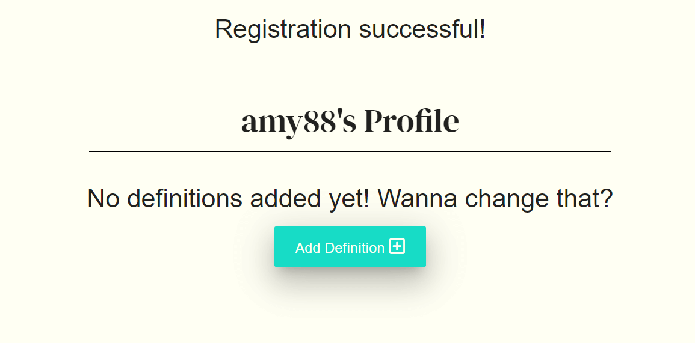

### Additional rendering was also put in place to pre-emptively plan for the event that the newly registered user:

* **Added a definition to site but did **not** add a definition to 'My Favourites':**

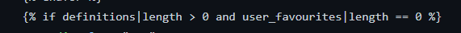
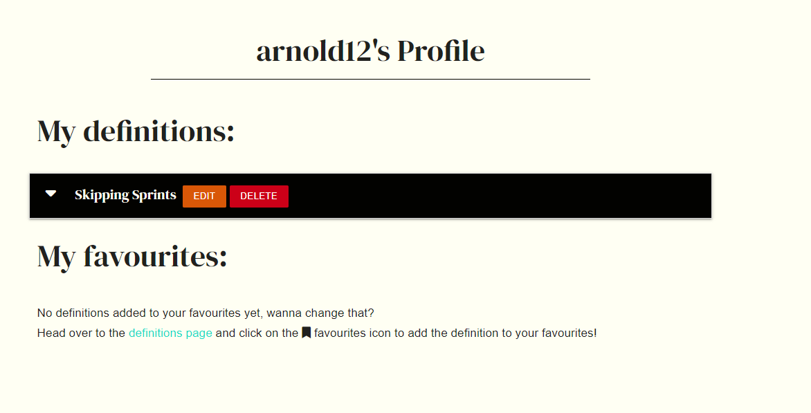

* **Added a definition to 'My Favourites' but did **not** add a definition to the site:** 

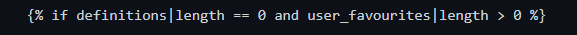
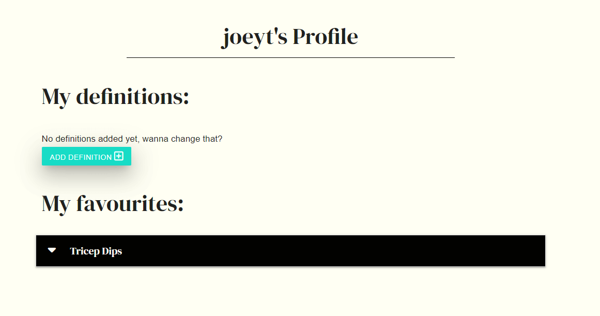

# Maintaining the amount of upvotes and downvotes on a definition that has been 'edited'.
While the original functionality for upvote and downvote was working, a bug arose when the a definition was updated or edited. The initial functionality added the user_id into either the upvote or downvote array stored in each definition document depending on the button clicked. It was noted however that the 'upvote' and 'downvote' arrays were emptied and the count on the respective buttons were reset to zero on a definition that had been edited. In order to resolve this issue, all aspects of the functionality was assessed. 

To resolve this issue, it was necessary for the amount of upvotes and downvotes to be included in the pre-existing data sent to the edit_definition form. In order to do so, two hidden inputs were added to the edit_definition form, as these inputs do not need to be edited, they are hidden from the user. The value attribute set provides the count of the arrays. In app.py, both the upvote and downvote are requested from the form and a pre-emptive default amount is set. They are then updated with the rest of the submit dictionary.

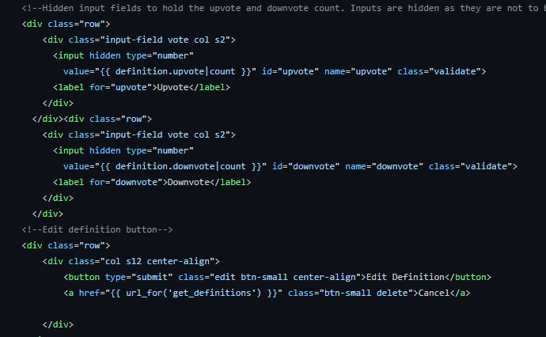
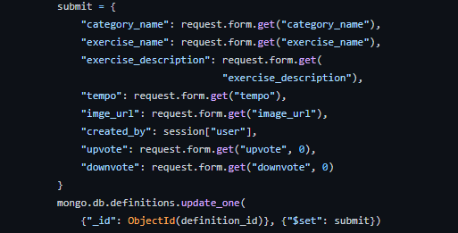
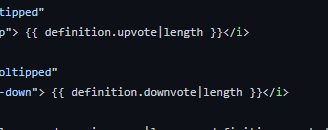

 
At this stage, the developer also introduced some structure to user voting:
* If a user has upvoted a definition, they cannot also downvote the same definition and vice versa.
* To remove their vote a user can click on the button again and are now free to vote again. 

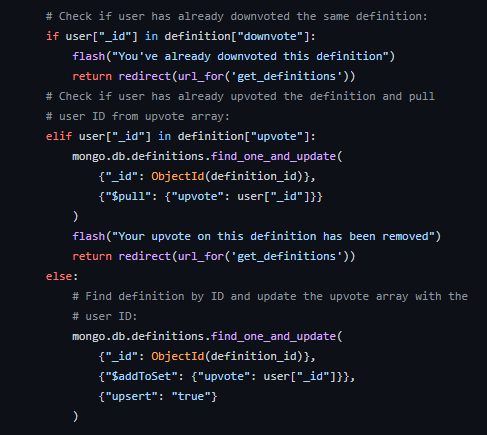
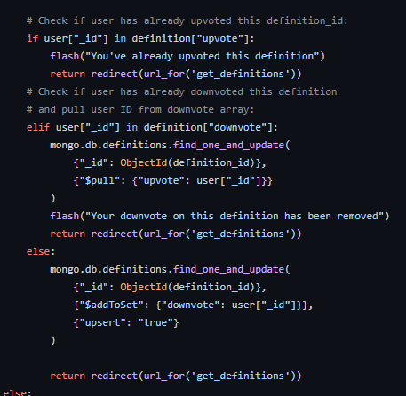

Upon implementing this structure, it was necessary to create two arrays for 'upvote' and 'downvote' upon creation of a definition.

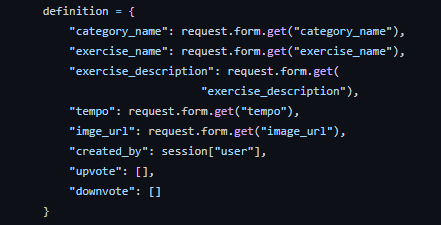

Following the changes made above the bug was resolved and a greater degree of structure was implemented to the voting functionality. 

# Manual functionality testing:

# User Authentication: 

## **Registration functionality:**
Following completion of the function register(), the function and form were tested manually. The functionality was tested in the following manner: 

1. Attempt registration by providing **neither** a username or password and clicking on the 'Register' button.:
	INSERT PIC HERE
	**Result:** User is prompted to fill in the fields. 
	
2. Attempt registration with an **invalid** username and **valid** password:
INSERT PIC HERE
**Result:** User is prompted to 'Please match the format requested', the form validation or pattern recognition required has not been met for the username. 

3. Attempt registration by submitting the form filling out both inputs with nothing but spaces:
INSERT PIC HERE
**Result:** User is again prompted to 'Please match the format requested' and the form validation and pattern recognition are throwing errors. 

4. Attempt registration with a **valid** username and an **invalid** password:
INSERT PIC HERE
**Result:** User is prompted to 'Please match the format requested'. The form validation and pattern recognition are throwing errors for the password. 

5. Attempt registration with a **valid** username and **valid** password: 
INSERT PIC HERE
**Result:**  The form validation and pattern recognition are accepting both the username and password, the user is redirected to their profile and receive a flash message of 'Registration Successful'. 

## **Log In functionality:**
Following completion of the function login(), the function and form were tested manually. The functionality was tested in the following manner: 

1. Attempt login by providing **neither** a username or password and clicking on the 'Register' button.:
	INSERT PIC HERE
	**Result:** Neither form validation or pattern recognition requirements have been met. The user is prompted to fill in the fields.
	 
2. Attempt login with an **invalid** username and **valid** password:
INSERT PIC HERE
**Result:** The form redirects back to the login page and the user is informed by the flash message that either an incorrect username or password have been entered. 

3. Attempt login by submitting the form filling out both inputs with nothing but spaces:
INSERT PIC HERE
**Result:** User is again prompted to 'Please match the format requested' and the form validation and pattern recognition are throwing errors. 

4. Attempt login with a **valid** username and an **invalid** password:
INSERT PIC HERE
**Result:** The form redirects back to the login page and the user is informed by the flash message that either an incorrect username or password have been entered. 

5. Attempt login with a **valid** username and **valid** password: 
INSERT PIC HERE
**Result:**  The form validation and pattern recognition are accepting both the username and password, the user is redirected to their profile and receive a flash message of 'Welcome {username}'.

## **Log Out functionality:** 
Following completion of the function logout(), manual testing was carried out against the functionality. The functionality was tested in the following manner:

**1. Log in as user and logout:**
INSERT PIC HERE

**Results:** Once logged in as a user, the changes in the nav-items is apparent, a regular user has access to the following nav-items: 
* Home
* Profile
* Add Definition
* Categories
* Log Out

The users login status can be confirmed in 'Cookies' found in the 'Application' section of Dev Tools, as the 'session cookie' is present. To logout the user clicks on the 'Log Out' nav-item and receives a flash message to inform them that they have been logged out and are redirected to login page. Checking against Dev Tools 'Cookies', it's noted that the session cookie has been deleted. 

**2. Log in as admin and logout:** 
INSERT PIC HERE

**Results:** Once logged in as an admin, the changes in the nav-items is apparent, an admin has access to the following nav-items:
* Home
* Profile
* Add definition
* Category Management
* Log Out

The admin's login status can be confirmed in 'Cookies' found in the 'Application' section of Dev Tools, as the 'session cookie' is present. To logout the admin clicks on the 'Log Out' nav-item and receives a flash message to inform them that they have been logged out and are redirected to login page. Checking against Dev Tools 'Cookies', it's noted that the session cookie has been deleted.

# CRUD OPERATIONS
## **Create/Add:**
### Add Definition:
Following the completion of add_definition functionality, manual testing was carried out against the functionality. It was tested in the following manner:
 
 * Click on 'Add Definition' in the Navbar.
 * Once redirected to add definition form, fill out field inputs and click 'Add Definition' button.
 * User is informed of a successful creation by the Flash message and is redirected to the home page.
INSERT IMG OF FORM AND FLASH MESSAGE

### Add Category: **Admin only**
Following the completion of the add_category functionality, manual testing was carried out against the functionality. It was tested in the following manner:
* Navigate to 'Category Management' via the navbar.
* Click on the 'Add Category' panel.
* Admin is redirected to the add category form.
* Fill out the necessary input fields.
* Click 'Add Category' button.
* Following a successful category creation, the category management page is reloaded and the admin is provided with user confirmation via a Flash message. 
INSERT IMG OF FORM AND FLASH MESSAGE 

## **Read:**
Users of the app have the ability to read data in the following areas of the site:

**Home page:**
* Recently added definitions.

**Categories:**
* Different categories available across the site, access and read definitions refined by category.

**User profile:**
* User created definitions.
* User favourites. 

ADD IMG OF ALL OF THE ABOVE

## **Update/Edit:** 
### Edit Definition:
Following the completion of the edit_definition functionality, manual testing was carried out against the functionality. It was tested in the following manner:
**Note:** Edit functionality is restricted to the users own definitions. 

* Select the definition you wish to edit.
* Click on the 'Edit' button available on the definition card panel.
* Once redirected to the edit definition form, make the necessary edits to the definition. 
* Click the 'Edit Definition' button to update the definition. 
INSERT IMG OF FORM AND FLASH MESSAGE

### Edit Category: **Admin only**
Following the completion of the edit_categories functionality, manual testing was carried out against the functionality. It was tested in the following manner:
* Navigate to 'Category Management' via the navbar.
* Select the category to edit.
* Edit the existing data in the edit category form.
* Click on 'Edit Category' button.
* Following a successful edit, the category management page is reloaded and the admin is provided with user confirmation via a Flash message.
INSERT IMG OF FORM AND FLASH MESSAGE 

## **Delete:**
Delete functionality/operations are available across the following areas of the app: 

### Delete definition:

Each individual definition card panel has a 'Delete' button. Prior to the deletion of a definition, a user will be prompted to provide user confirmation via a modal. Users can delete their own definitions in the following manner:
	
* Navigate to the definition you wish to delete. 
* Click the 'Delete' button.  
* Confirm action via the modal.
* The user will be redirected back to their profile and will receive user feedback via a Flash message. 

**Note:** The ability to delete a user added definition has also been extended to Admins. To delete a user added definition, admins also follow the steps outlined above. 

### Delete category:  **Admin only**

Admins have the ability to delete categories as they see fit, each category panel has a 'Delete' button. Prior to the deletion of a category, the admin will be prompted to provide user confirmation via a modal. Admins can delete a category in the following manner: 
* Navigate to the 'Category Management' using the navbar.
* Select the category you wish to delete. 
* Click the 'Delete' button on the selected panel.
* Upon deletion of the category, the category management page will reload and the admin will be informed of a successful deletion through a Flash message. 
* The deleted category will have been removed from the page. 
INSERT PIC OF CATEGORY DELETION

## Cancel functionality: 
The ability to 'cancel' is available across the following areas of the app:

**Add definition form:**
If a user chooses not to add a new definition they can click on the 'Cancel' button on the add definition form and will be redirected back to the home page.
INSERT IMG OF CANCEL BUTTON

**Edit definition form:**
If a user chooses not to edit an existing definition, they can click on the 'Cancel' button on the edit definition form and will be redirected back to the home page.
INSERT IMG OF CANCEL BUTTON

**Delete definition confirmation modal:**
Prior to the deletion of a definition, a user will be prompted to provide user confirmation via a modal. If the user chooses not to delete a definition, they can click the 'Cancel' button and be redirected back to the home/profile page.
INSERT IMG OF DELETION MODAL  

**Add category form: [Admin only]**
If an admin chooses not to add a new category, they can click on the 'Cancel' button on the add category form and will be redirected back to the category management page.
INSERT IMG OF CANCEL BUTTON

**Edit category form: [Admin only]**
If an admin chooses not to edit an existing category, they can click the 'Cancel' button on the edit category form and will be redirected back to the category management page.
INSERT IMG OF CANCEL BUTTON

**Delete category confirmation modal: [Admin only]**
Prior to the deletion of a category, the admin will be prompted to provide user confirmation via a modal. If an admin chooses not to delete a category, they can click on the 'Cancel' button and will be redirected back to the category management page. 
INSERT IMG OF DELETION MODAL 

# **Features:**
## **Upvote/Downvote:**
This functionality has been implemented in the following areas of the site: 
* Definitions.html
* Category_pg.html
* Search query results

Users **must be logged in to 'upvote' or 'downvote'** on a definition, this functionality is available on all definition panels. This functionality was tested in the following manner:

**On definitions.html:**
* Login or register with the site.
* Navigate to the home page from the nav-bar
*   Choose whether to  'upvote' or 'downvote' a definition
	* Click on 'thumbs up' icon to upvote
	* Click on 'thumbs down' icon to downvote
* This triggers either the upvote or downvote function and increments the count by one 

**On category_pg.html:**
* Login or register with the site.
* Navigate to the category page of your choosing from the nav-bar
*   Choose whether to  'upvote' or 'downvote' a definition
	* Click on 'thumbs up' icon to upvote
	* Click on 'thumbs down' icon to downvote
* This triggers either the upvote or downvote function and increments the count by one

**From search query results:**
* Login or register with the site.
* Navigate to the home page from the nav-bar
* On larger viewports, click on either of the magnify icon in the nav-bar or in the FAB to reveal the search bar
* On smaller viewports, navigate to the search bar by using the search FAB.
* Once redirected to the search bar, provide a search query and hit search
*  This triggers the search function and the search query results are made available to user below the search bar
*   Choose whether to  'upvote' or 'downvote' a definition
	* Click on 'thumbs up' icon to upvote
	* Click on 'thumbs down' icon to downvote
* This triggers either the upvote or downvote function and increments the count by one 

## **User favourites:** 
This functionality has been implemented in the following areas of the site: 
* Definitions.html
* Category_pg.html
* Search query results

Once the user adds a definition to their favourites, they can be viewed on their profile page. Adding a definition to user favourites was manually tested in the following manner:

**On definitions.html:**
* Choose the definition you wish to add to your favourites
* Click on the 'add to favourites' icon available on all definition cards
* The page is reloaded and user feedback is provided in the form of a flash message "Saved to favourites."

**On category_pg.html:**
* Choose the category from the nav-bar dropdown menu and click to redirect to that page
* Choose the definition you wish to add to your favourites
* Click on the 'add to favourites' icon available on all definition cards
* The page is reloaded and user feedback is provided in the form of a flash message "Saved to favourites."

**From search query results:**
* On larger viewports, click on either of the access options (magnify icon in the navbar or in the FAB) to reveal the search bar
* On smaller viewports, navigate to the search bar by using the search FAB or navigate to the home page from the nav-bar.
* Once redirected to the search bar, provide a search query and hit search
*  This triggers the search function and the search query results are made available to user below the search bar
*  Choose the definition you wish to add to your favourites
* Click on the 'add to favourites' icon available on all definition cards
* The page is reloaded and user feedback is provided in the form of a flash message "Saved to favourites."
 

## **Search functionality:**
The search functionality has been implemented on definitions.html but can be accessed on any page of the site by using:
* Magnify icon in the search bar
* Magnify icon in the FAB

Clicking on either of these will redirect the user to the search bar. The search functionality was manually tested in the following manner:

* On larger viewports, click on either of the access options above to reveal the search bar
* On smaller viewports, navigate to the search bar by using the search FAB or navigate to the home page from the nav-bar.
* Once redirected to the search bar, provide a search query and hit search
*  This triggers the search function and the search query results are made available to user below the search bar
* Click 'Reset' to clear the query and recently added definitions are returned below the search bar
* Provide two different words in the search query eg. "glutes" "upper" and click 'search'
This triggers the search function and the search query results are made available to user below the search bar, displaying a variety of definitions from the 'glutes' and 'upper body' categories
* Click 'Reset' to clear the query and recently added definitions are returned below the search bar
* Provide a search query that will not return a definition in the results eg. "Elephant" and click 'search'
* This triggers the search function and the site conditionally renders the code block for if there are no definitions related to this query. 
INSERT IMGS HERE
* This can be cleared by selecting the 'reset' button in the search bar 

## **Share definitions:**
Share definition functionality is available in the following areas of the site:
* Definitions.html
* Category_pg.html
* Search query results

This functionality is available to all users, not just those who are logged in or have created an account. The share definition functionality was testing the following manner:

**On definitions.html:**
* Select definition you wish to share
* Click on the 'share' icon 
* Icon trigger the share modal
* Select the social media platform you wish to share on and click to open the site in a new tab

**On Category_pg.html:**
* Navigate to the category page of your choosing from the nav-bar dropdown menu
* Select definition you wish to share
* Click on the 'share' icon 
* Icon trigger the share modal
* Select the social media platform you wish to share on and click to open the site in a new tab

**From search query results:**
* Navigate to the search bar from either the nav-bar or FAB
* Search for a particular definition
* From the search query results, select the definition you wish to share
* Click on the 'share' icon 
* Icon trigger the share modal
* Select the social media platform you wish to share on and click to open the site in a new tab

## **Floating Action Buttons:**
The floating action buttons are available across the site. They were tested in the following manner across multiple viewports:

**Scroll to top button:**
* Scroll to the bottom of the page
* On larger viewports: hover over the FAB to open
	* Click the 'scroll to top' button
	* Button triggers the function and user is scrolled to top
On smaller viewports: click on the FAB to open
	* Click on the 'scroll to top' button
	* Button triggers the function and user is scrolled to top

**Add Definition:**
*  On larger viewports: hover over the FAB to open
	* Click the '+' icon to add definition
	* Button triggers the function and user is redirected to the add definition form.
* On smaller viewports: click on the FAB to open
	* Click the '+' icon to add definition
	* Button triggers the function and user is redirected to the add definition form.

**Search function:**
*  On larger viewports: hover over the FAB to open
	* Click the magnify icon to search for a definition
	* Button triggers the function and user is redirected to the top of definitions.html and the search bar is triggered. 
* On smaller viewports: click on the FAB to open
	* Click the magnify icon to search for a definition
	* Button triggers the function and user is  redirected to the top of definitions.html where the search bar is NOT hidden on smaller screens. 

## **Pagination:**
Flask pagination has been implemented in the following areas of the site:
* Definitions.html
* Category_pg.html
* Search query results (if necessary)

This functionality was tested in the following manner on a variety of viewports: 
**On definitions.html:**
* Scroll to the bottom of the page
* Move to the 'Next' page of results using the numbered pagination link
* Move to the 'Next' page using the >> icon pagination link
* Move to the 'Previous' page using the numbered pagination link
* Move to the 'Previous page using the << icon pagination link

**On Category_pg.html:**
* Scroll to the bottom of the page 
* Move to the 'Next' page of results using the numbered pagination link
* Move to the 'Next' page using the >> icon pagination link
* Move to the 'Previous' page using the numbered pagination link
* Move to the 'Previous page using the << icon pagination link

**For search query results:**
* Scroll to the bottom of the page 
* Move to the 'Next' page of results using the numbered pagination link
* Move to the 'Next' page using the >> icon pagination link
* Move to the 'Previous' page using the numbered pagination link
* Move to the 'Previous page using the << icon pagination link

 

 ## **Base.html**

| **Element**                 | **Action** | **Expected Outcome**                                        | **Pass/Fail** | **Notes**                                                             |
|-------------------------|--------|---------------------------------------------------------|-----------|-------------------------------------------------------------------|
| **Navbar**                  |        |                                                         |           |                                                                   |
| Navbar Brand            | Click  | Redirect to home                                        | Pass      |                                                                   |
| Home                    | Click  | Redirect to home                                        | Pass      |                                                                   |
| Profile                 | Click  | Redirect to Profile                                     | Pass      |                                                                   |
| Categories              | Click  | Opens dropdown menu for category selection              | Pass      | Only available to users not Admin                                 |
| Add Definition          | Click  | Redirects to Add definition form                        | Pass      | Only available if user is logged in                               |
| Category Management     | Click  | Redirect to Category Management                         | Pass      | Only available to Admin users                                     |
| Log In                  | Click  | Redirect to Log In page                                 | Pass      | Not visible if user is logged in                                  |
| Log Out                 | Click  | Logs user out of account, redirecting to Log In page    | Pass      | Only visible if user is logged in                                 |
| Register                | Click  | Redirects to register page                              | Pass      | Not visible if user is logged in                                  |
| **SideNav**                 |        |                                                         |           |                                                                   |
| Hamburger Icon          | Click  | Opens sidenav menu                                      | Pass      | Available on smaller viewports.                                   |
| Navbar Brand            | Click  | Redirects to home page                                  | Pass      |                                                                   |
| Home                    | Click  | Redirects to home page                                  | Pass      |                                                                   |
| Profile                 | Click  | Redirects to profile page                               | Pass      | Only available to logged in users                                 |
| Categories              | Click  | Opens dropdown categories menu                          | Pass      | Only available to users not admin                                 |
| Add Definition          | Click  | Redirects to Add definition form                        | Pass      | Only available if user is logged in                               |
| Category Management     | Click  | Redirects to category management                        | Pass      | Only available to Admin users                                     |
| Log In                  | Click  | Redirects to log in page                                | Pass      | Not available to logged in users                                  |
| Log Out                 | Click  | Logs user out and redirects to login page               | Pass      | Only available if user is logged in                               |
| Register                | Click  | Redirects to register page                              | Pass      | Not visible to logged in users                                    |
| **Section**                 |        |                                                         |           |                                                                   |
| Message Flashing        | Click  | Displays user feedback across site                      | Pass      |                                                                   |
| Floating Action Buttons | Click  | Displays icons for search, add definition and scroll up | Pass      | Add definition functionality is only available to logged in users |
| Search                  | Click  | Renders search bar to screen                            | Pass      |                                                                   |
| Add definition          | Click  | Redirects to add definition form                        | Pass      | Only available to logged in users                                 |
| Scroll to the top       | Click  | Automatically scrolls user back to the top of the page  | Pass      |                                                                   |
| **Footer**                  |        |                                                         |           |                                                                   |
| Facebook Link           | Click  | Opens Facebook in a new tab                             | Pass      |                                                                   |
| TikTok Link             | Click  | Opens Tiktok in a new tab                               | Pass      |                                                                   |
| Instagram Link          | Click  | Opens Instagram in a new tab                            | Pass      |                                                                   |
| Youtube                 | Click  | Opens Youtube in a new tab                              | Pass      |                                                                   |

## **Definitions.html:**
| **Element**                | **Action** | **Expected Output**                                                          | **Pass/Fail** | **Notes**                                                                        |
|------------------------|--------|--------------------------------------------------------------------------|-----------|------------------------------------------------------------------------------|
| **Search**             |   |                                                              |     || Search Bar             | Search | Input search query                                                       | Pass      |                                                                              |
| Search Btn             | Search | Triggers search of database using query                                  | Pass      |                                                                              |
| Reset Btn              | Reset  | Redirects to the home page definition.html                               | Pass      |                                                                              |
| **Definition Card Panel**  |        |                                                                          |           |                                                                              |
| Add to favourites icon | Click  | Triggers add_to_favourites and saves definition to user_favourites array | Pass      | Only available to logged in users, will trigger redirect to login            |
| Share icon             | Click  | Triggers share modal and presents platforms to share to                  | Pass      |                                                                              |
| Upvote icon            | Click  | Increments the upvote count for a specific definition                    | Pass      | Only available to logged in users                                            |
| Downvote icon          | Click  | Increments the downvote count for a specific definition                  | Pass      | Only available to logged in users                                            |
| Tooltips               | Hover  | Provide further information on icons when icon is hovered over           | Pass      |                                                                              |
| Edit Btn               | Click  | Redirects to edit definition form                                        | Pass      | Only available to logged in users                                            |
| Delete Btn             | Click  | Triggers delete confirmation modal                                       | Pass      | Must click 'Delete' on confirmation modal to delete, available to admin also |
| **Modals**                 |        |                                                                          |           |                                                                              |
| Share Modal            | Click  | Click social media platform you wish to share on                         | Pass      | Triggered by share icon                                                      |
| Facebook link          | Click  | Opens Facebook in new tab                                                | Pass      |                                                                              |
| TikTok link            | Click  | Opens TikTok in new tab                                                  | Pass      |                                                                              |
| Instagram link         | Click  | Opens Instagram in new tab                                               | Pass      |                                                                              |
| Youtube link           | Click  | Opens Youtube in new tab                                                 | Pass      |                                                                              |
| Cancel Btn             | Click  | Closes modal                                                             | Pass      |                                                                              |
| Delete Modal           | Click  | Confirm to delete specific definition                                    | Pass      | Triggered by Delete btn                                                      |
| Delete Btn             | Click  | Triggers delete_definition function and deletes specific definition      | Pass      |                                                                              |
| Cancel Btn             | Click  | Closes modal                                                             | Pass      |
| **Pagination**             |   |                                                              |     |                                                                              |
| << Btn                 | Click  | Redirects back to previous definitions page                              | Pass      |                                                                              |
| Pagination Links       | Click  | Numbered buttons to redirect to specific page                            | Pass      |                                                                              |
| >> Btn                 | Click  | Redirects forward to next definitions page                               | Pass      |                                                                              |

## **Add_definition.html:**
| **Element**            | **Action** | **Expected Output**                                        | **Pass/Fail** | **Notes**                                                                              |
|--------------------|--------|--------------------------------------------------------|-----------|------------------------------------------------------------------------------------|
| **Form**              | POST   | Fill out and submit definition to database             |           |                                                                                    |
| Category Dropdown  | Click  | Reveals category options to choose from                | Pass      | Required                                                                           |
| Input text fields  | Type   | Text appears, green line if validated, red line if not | Pass      | Required                                                                           |
| Textarea           | Type   | Text appears, green line if validated, red line if not | Pass      | Required                                                                           |
| URL upload         | Click  | Paste in URL for image to upload with definition       | Pass      | Not required                                                                       |
| Tooltips           | Hover  | Provide further instruction for form fields            | Pass      |                                                                                    |
| Add definition Btn | Click  | Submits definition to the database                     | Pass      | Form will not submit if not correctly validated and all required fields filled out |
| Cancel Btn         | Click  | Cancel action and redirects back to home page          | Pass      |                                                                                    | 

## **Edit_definition.html:**
| **Elements**                 | **Action** | **Expected Output**                                                 | **Pass/Fail** | **Notes**                                                 |
|--------------------------|--------|-----------------------------------------------------------------|-----------|-------------------------------------------------------|
| **Form**                     | POST   | Edit specific definition form and update in database                       | Pass      | Filled with pre-existing data to be edited as chosen |
| Category select dropdown | Click  | Reveals category selection options                              | Pass      | Required                                              |
| Input text fields        | Type   | Text appears, green line if validated, red line if not          | Pass      | Required                                              |
| Textarea                 | Type   | Text appears, green line if validated, red line if not          | Pass      | Required                                              |
| Tooltip                  | Hover  | Provides further instruction for form fields                    | Pass      |                                                       |
| URL image upload         | Click  | Include URL of image to upload with definition                  | Pass      | Not required                                          |
| Edit Btn                 | Click  | Triggers edit_definition function and uploads edited definition | Pass      |                                                       |
| Cancel Btn               | Click  | Cancels edit of definition, redirects back to home page         | Pass      |                                                       |

## **Categories.html:**
| **Elements**                 | **Action** | **Expected Output**                                                 | **Pass/Fail** | **Notes**                                                 |
|--------------------------|--------|-----------------------------------------------------------------|-----------|-------------------------------------------------------|
| **Category Card**    |        | Holds the edit/delete btns for category management                    |           |       |
| Edit Btn         | Click  | Triggers edit_category function and redirects to edit category form   | Pass      |       |
| Delete Btn       | Click  | Triggers deletion confirmation modal                                  | Pass      |       |
| Delete Modal     | Click  | Triggered by delete btn, confirmation is required prior to deletion   | Pass      |       |
| Delete Btn       | Click  | Triggers delete_definition function and deletes a specific definition | Pass      |       |
| Add Category Btn | Click  | Triggers add_category function and redirects to add category form     | Pass      |       |

## Category_pg.html:
| **Elements**         | **Action** | **Expected Output**                                                       | **Pass/Fail** | **Notes**                                             |
|------------------|--------|-----------------------------------------------------------------------|-----------|---------------------------------------------------|
| **Category_pg**      |        | Dynamically generates category page upon selection from dropdown menu | Pass      |                                                   |
| Card Panel       |        | Definition panels refined by category                                 |           |                                                   |
| Upvote icon      | Click  | Increments upvote count                                               | Pass      | Users must be logged in to use this functionality |
| Downvote icon    | Click  | Increments downvote count                                             | Pass      | Users must be logged in to use this functionality |
| **Pagination**             |   |                                                              |     |
| << Btn           | Click  | Redirect to previous page                                             | Pass      |                                                   |
| Pagination Links | Click  | Numbered buttons to redirect to specific page                         | Pass      |                                                   |
| >> Btn           | Click  | Redirect to next page                                                 | Pass      |                                                   |

## **Edit_category.html:**
| **Element**           | **Action** | **Expected Output**                                           | **Pass/Fail** | **Notes**                                           |
|-------------------|--------|-----------------------------------------------------------|-----------|-------------------------------------------------|
| **Form**              | POST   | Edit specific category form and submit to database        | Pass      | Filled with pre-existing data to edit as chosen |
| Input text fields | Type   | Text appears, green line if validated, red line if not    | Pass      | Required                                        |
| Tooltip          | Hover  | Provides further instruction for form fields            | Pass      |          |
| Edit Btn          | Click  | Triggers submission of edited category                    | Pass      |                                                 |
| Cancel Btn        | Click  | Cancels edit of category and redirects to get_categories  | Pass      |                                                 |

## **Login.html:**
| **Element**          | **Action** | **Expected Output**                           | **Pass/Fail** | **Notes**    |
|------------------|--------|--------------------------------------------------------|-----------|----------|
| Form             | POST   | Log In form, logs in user to site                      | Pass      |          |
| Input text field | Type   | Text appears, green line if validated, red line if not | Pass      | Required |
| Tooltip          | Hover  | Provides further instruction for form fields            | Pass      |          |
| Log In Btn       | Click  | Submit btn logs user into the app                      | Pass      |          |
| Register Link    | Click  | Redirects unregistered user to register.html           | Pass      |          |
 
## **Registration.html:**
| **Element**          | **Action** | **Expected Output**                           | **Pass/Fail** | **Notes**    |
|------------------|--------|---------------------------------------------------------|-----------|----------|
| Form             | POST   | Registration form to sign up site visitor               | Pass      |          |
| Input text field | Type   | Text appears, green line if validated, red line if not  | Pass      | Required |
| Tooltip          | Hover  | Provides further instruction for form fields            | Pass      |          |
| Register Btn     | Click  | Submits registry information to the database            | Pass      |          |
| Log In Link      | Click  | Redirect to Log In page for previously registered users | Pass      |          |

## **Profile.html:**
| **Element**          | **Action** | **Expected Output**                           | **Pass/Fail** | **Notes**    |
|-----------------------|--------|-------------------------------------------------------------------------|-----------|-------|
| Collapsible Accordian |        | Displays user created definitions                                       | Pass      |       |
| Edit Btn              | Click  | Triggers edit_definition function and redirects to edit form            | Pass      |       |
| Delete Btn            | Click  | Triggers delete modal for specific definition                           | Pass      |       |
| Modal                 |        | User confirmation for definition deletion                               |           |       |
| Delete Btn            | Click  | Triggers delete_definition function and deletes specific definition     | Pass      |       |
| Cancel Btn            | Click  | Modal close                                                             | Pass      |       |
| Collapsible Accordian |        | Displays user favourite definitions                                     | Pass      |       |
| Delete Btn            | Click  | Triggers delete modal for specific user favourite                       | Pass      |       |
| Edit Btn              | Click  | Triggers edit_definition function and redirects to edit definition form | Pass      |       |
| Modal                 |        | User confirmation for definition deletion                               | Pass      |       |
| Delete Btn            | Click  | Triggers delete_definition function and deletes specific definition     | Pass      |       |
| Cancel                | Click  | Modal close                                                             | Pass      |       |
| Add definition Btn    | Click  | Redirects to add_definition form                                        | Pass      |       |

# Validation Testing

## HTML
The HTML5 for this site was tested and validated using [W3C Markup Validation Service](https://validator.w3.org/). Due to the jinja templating used throughout, the site was tested by coping the page source of the live site and running it through the validator. Certain pages were ran through multiple times as they can render differently depending on, for example, the status of the user or, the amount of definitions that have been added to a particular category. This was the case for the following pages:
* Profile page
* Category_pg

All pages were passed and validated. 

## CSS
The style.css file for this site was tested and validated using [W3C CSS Markup Validation Service](https://jigsaw.w3.org/css-validator/).  The CSS returned free of errors. Following this, the CSS was then parsed and had vendor prefixes added using [Autoprefixer CSS Online](https://autoprefixer.github.io/).
INSERT IMG OF CSS VALIDATION

## JavaScript
The script.js file for this project was validated using [JSHint](https://jshint.com/).  The file was flagged for missing semicolons, however once this was rectified there was no errors in the script.js file. 

## Python
The app.py file was validated using [PEP8 Online](http://pep8online.com/). The only errors flagged were due to either 'continuation line with the same indent as next logical line' or continuation line over/under indented for visual indent.' Once the changes were made the code passed all checks.

# Lighthouse Performance
Coming to the end of the development stage for the project, a lighthouse report was generated using [Chrome Dev Tools](https://developers.google.com/web/tools/lighthouse). The initial scores suggested some improvements could be made.
INSERT IMG OF FIRST LIGHTHOUSE

The following changes were made to improve the scores: 

**Performance:**
* The hero image used on index.html was converted from JPEG to WebP format for better compression and a quicker first contextual paint. 
* The height of the hero image was also reduced.

**Accessibility:**
* Use sequential headers throughout the site. 
* Alter the color of buttons and anchor links to increase visibility and contrast.

**SEO:**
* Include additional metadata tags in the head of base.html

The changes made helped increase these scores. While I would have preferred a higher score for the performance and SEO. However, when reports were generated for other pages of the site, higher scores in these areas were achieved.

# Cross-browser compatibility 
To test for cross-browser compatibility, the site was tested using [PowerMapper](https://www.powermapper.com/). Cross-browser compatibility tested well. 

The only issue flagged here was:
"The `display: flex` CSS property (that was added to the body element) does not work correctly in some browsers" and indicated that this would be an issue with Internet Explorer 11.

To verify this issue, I consulted [Browserling](https://www.browserling.com/). While the `display: flex` did not seem to cause an issue, the newly formatted hero image was no longer displaying. While the WebP format is widely supported across modern browsers, it is not a format that is supported by older browsers.

To rectify this issue, 

# Responsive Testing
The site's responsiveness was testing on the following devices in person:

**Mobile:**
* Huawei P30 Pro
	* Google Chrome
	* Huawei Browser
* Samsung 
	* Google Chrome
	* Samsung Internet

**Tablet:**
* HP Envy x360 - Tablet mode (portrait & landscape)

**Desktop:**
* HP Envy x360
	* Google Chrome
	* Microsoft Edge
	* Mozilla Firefox
	* Opera 

**Chrome Dev Tools:**
Was employed to view the site on a larger variety viewports. 

**Responsinator:**
Was employed where a device or browser wasn't accessible.